<!-- _class: title -->
<!-- _paginate: false -->
<!-- _footer: "" -->

# Git: Beyond the Basics

C2SM Git Courses · 8 October 2026
Michael Jähn, Mikael Stellio, Alitzel Macías Infante

<!--
- Welcome everyone, introduce the three of us
- Show of hands to calibrate the room:
  - Who uses Git daily vs. only occasionally?
  - Who has already worked with web interfaces such as GitHub or GitLab?
- Set expectations:
  - Hands-on day, roughly half the time is exercises
  - We walk around to help - nobody should sit stuck in silence
-->

---

<style scoped>
section {font-size: 25px;}
</style>

# Outline

<div class="columns">
<div>

<div class="compact-lines">

### Part 1: Your Git Toolbox
- Examining history: `log`, `blame`, `diff`, `show`
- Nesting repositories with submodules
- Ignoring files
- `git cherry-pick` and `git rebase`
- `git stash` and `git worktree`
- Custom Git hooks
- Large files with `git lfs`
- Exercises 1 – 7

</div>

</div>
<div>

<div class="compact-lines">

### Part 2: Working Together on GitHub
- Why a shared workflow
- A real example: the C2SM User Landing Page
- Issues, forks and branches
- Pull requests, checks and review
- Keeping your fork in sync
- GitHub and GitLab side by side
- Exercise 8

</div>

</div>
</div>

<div class="note">

You only need the **Git basics** for this course: `add`, `commit`, `push`, `pull`, `branch`.

</div>

---

<style scoped>
.schedule-list {
  font-size: 34px;
}
.schedule-list li {
  margin-block: 10px;
}
</style>

# Schedule

<div class="no-bullets schedule-list">

- **09:30 – 09:40** Welcome and overview
- **09:40 – 10:50** Part 1 · history, submodules, .gitignore → Exercises 1 – 3
- **10:50 – 11:10** Coffee break ☕
- **11:10 – 11:50** Part 1 · moving, parallel work → Exercises 4 – 5
- **11:50 – 12:30** Part 1 · hooks and large files → Exercises 6 – 7
- **12:30 – 13:30** Lunch break 🍽️
- **13:30 – 14:30** Part 2 · slides and live demonstration
- **14:30 – 15:00** Part 2 · Exercise 8 and wrap-up

</div>

<!--
- Point at the two breaks so people can plan around them, mention where coffee and toilets are
- Watch the clock against this slide during the day
  - Usual failure mode: too long on the first two topics, then rushing hooks and LFS
  - If running late by the coffee break: shorten the theory for stash/worktree, not an exercise
- Exercise 8 needs GitHub accounts and pairs - flag now that they should sort out an account over lunch if they don't have one and find an exercise partner
-->

---

<!-- _class: section -->

# Part 1:
# Your Git Toolbox

<!--
- Framing for this half: everything here is a tool you reach for occasionally, not daily
- Goal is not to memorise the flags
  - Goal is to know the tool exists and what problem it solves
  - So months from now: "there was something for this" and look it up
-->

---

# Recap: Typical Git Workflow


- Everything up to `git commit` happens **on your machine**
- Only `git push` and `git fetch` talk to the server

<!--
- Short recap, two minutes at most - but don't skip it, the rest of Part 1 assumes people can place a command in this picture
- Walk the diagram left to right once: working directory → staging area → local repository → remote
- Point worth repeating: Git is not a client to a server
  - Commits are local and free
  - A mistake before `push` costs nothing
-->

---

# Examining History: Four Commands

<div class="no-bullets">
<div class="compact-lines">

- `git log`
  - which commits exist, by whom, and in what order

</div>

<div class="compact-lines">

- `git blame`
  - which commit last changed each **line** of a file

</div>

<div class="compact-lines">

- `git diff`
  - what changed between two points in the repository

</div>

<div class="compact-lines">

- `git show`
  - a single commit: message **and** its diff

</div>
</div>

<br>

Each takes many options. Exercise 1 explores the ones worth remembering.

<!--
- Motivate with the situation everybody recognises: open a file, find a line that makes no sense, want to know who wrote it and why
- The four commands answer four different questions - say them as questions:
  - log: what happened?
  - blame: who last touched this line?
  - diff: what is different between these two points?
  - show: what exactly did this one commit do?
- On blame, get ahead of the name: it is for understanding, not for finding someone to blame
  - The commit message it points you to is usually the real prize
-->

---

<style scoped>
table {font-size: 20px;}
</style>

# `git log`: Shaping and Filtering

| Option | What it does |
| --- | --- |
| `--oneline` | one line per commit |
| `--graph --decorate --all` | the branch structure of the whole repository |
| `--stat` | which files each commit touched |
| `-3` | only the last three commits |
| `--author="Lauber"` | only commits by a given author |
| `-- path/to/file` | only commits touching that file |
| `-S "Have fun!"` | commits that **add or remove** that text |
| `-G "regex"` | commits whose diff matches a regular expression |

<div class="note">

Found a combination you like? Save it: `git config --global alias.lg "log --oneline --graph --decorate --all"`

</div>

<!--
- Do not read the table out. Pick the two rows that earn their keep, let the exercise cover the rest
- Two worth demonstrating live:
  - `--graph --decorate --all` - cheapest way to see the branch structure without any GUI
  - `-S`, the "pickaxe" - finds the commit that introduced or removed a string
    - How you track down when a magic constant or a stray debug line appeared
    - Almost nobody knows about it
- Mention the `--` before a path: separates paths from branch names (matters when a file and a branch share a name)
- The alias tip will be part of the coming exercise, no need to do now
-->

---

# `git diff`: Choosing Two Points

<div class="no-bullets">
<div class="compact-lines">

- `git diff`
  - working directory vs. staging area

</div>

<div class="compact-lines">

- `git diff --staged`
  - staging area vs. last commit (what `git commit` would record)

</div>

<div class="compact-lines">

- `git diff main my-branch`
  - one branch against another

</div>

<div class="compact-lines">

- `git diff HEAD~10 HEAD~5 -- README.md`
  - two commits, restricted to one file

</div>
</div>

<div class="note">

Hard to read in a terminal? Use `git difftool --tool-help` to see what your system offers, or the web interface: add `/compare` to any GitHub repository URL.

</div>

<!--
- Single idea: `git diff` always compares two points, the only thing you ever change is which two
- First two lines are what people get wrong:
  - Plain `git diff` doesn't show what you already staged → "git diff shows nothing" is a common confusion right after `git add`
  - `--staged` is the answer - exactly the preview of what `git commit` will record
- Refer back to the recap diagram: each variant is an arrow between two boxes
-->

---

# Part 1 · Exercise 1

### `git log`, `git blame`, `git diff` and `git show`

<style scoped>
table {font-size: 20px;}
</style>

| Command | What it does |
| --- | --- |
| `git log --oneline --graph --decorate --all` | branch structure at a glance |
| `git log --author="name"` / `-- path` / `-S "text"` | filter commits |
| `git blame <file>` | who last touched each line |
| `git diff` / `git diff --staged` | unstaged vs. staged changes |
| `git show <commit>` / `git show <commit>:<path>` | inspect a commit / an old file version |

<div class="note">

**Where you work:** the `git-course` repository itself - we examine its real history.
All exercises: <https://github.com/C2SM/git-course/tree/main/advanced>

</div>

<!--
- First exercise - spend a moment on logistics:
  - Where the exercise files are
  - Call one of us over rather than get stuck
- Around 15 minutes. Walk the room
- Common stumbling block: quoting in `-S` and `--author`, especially on Windows shells
-->

---

# Nesting Repositories

- **Why?**
  - **Modularity** - break a large project into pieces that stand alone
  - **Independent history** - each piece keeps its own commits and releases
  - **Collaboration** - separate teams own separate pieces

<br>

- **Two mechanisms**
  - **Submodules** - Git's built-in approach, and the one C2SM models use
  - **Subtrees** - an alternative that copies content into the parent instead

<!--
- Start with the concrete case, not the abstraction: a climate model pulling in a shared physics package or an I/O library from another group
  - Want a specific, reproducible version - don't want to copy its source into your repository
- Say plainly: we teach submodules because that's what C2SM code uses
  - If they work with ICON or similar, they'll meet submodules whether they like them or not
- Subtrees get one sentence only: they exist, they copy content in instead of pointing at it, not covered today
-->

---

# A Submodule Is a Pointer to One Commit


The parent repository records **one exact commit** of the submodule, not "the latest".

<!--
- Key slide - slow down here
- Parent stores only a path, URL and commit hash (in `.gitmodules` + the recorded hash), not the submodule's files
  - Cloning the parent gives an empty directory until requested
  - The pointer doesn't move on its own - only an explicit commit in the parent advances it
  - Advancing it shows up in the parent's diff as a one-line hash change
- Ask the room: anyone seen a diff that's just two hashes? That's this
-->

---

# Working With Submodules

<div class="no-bullets">
<div class="compact-lines">

- `git submodule add <url> <path>`
  - adds the submodule and creates `.gitmodules`

</div>

<div class="compact-lines">

- `git clone --recurse-submodules`
  - clones the parent **and** fills in the submodules

</div>

<div class="compact-lines">

- `git submodule update --init`
  - fills them in after an ordinary `git clone`

</div>

<div class="compact-lines">

- `git submodule update --remote --merge`
  - moves the pointer forward to the submodule's latest commit

</div>
</div>

<div class="warning">

A plain `git clone` gives you **empty** submodule directories. This surprises everybody once.

</div>

<!--
- Four commands - the middle two are most important ones
- `--recurse-submodules` on clone is the habit worth forming
- `update --init` is the rescue command for when they forgot
  - `--init --recursive` handles submodules inside submodules (does happen in model code)
- Be explicit about the warning box: Taken the ICON example, the build fails with a confusing "file not found" error, not with anything mentioning submodules
- Also mention: `git status` inside a submodule shows a detached HEAD
  - Expected, not broken - the parent checked out a commit, not a branch
  - To make changes there, they have to check out a branch first
-->

---

<style scoped>
section {font-size: 24px;}
</style>

# Submodules: Pros and Cons

<div class="columns">
<div>

**Pros**

- Built into Git, nothing to install
- The parent records an exact, reproducible commit
- The submodule stays a normal repository
- Same submodule can be reused across multiple parent repos

</div>
<div>

**Cons**

- Every clone needs an extra step
- Easy to commit a pointer you never pushed
- Detached `HEAD` inside the submodule confuses people
- Branch operations do not recurse by default

</div>
</div>

<div class="note">

Some C2SM models and tools use submodules. Knowing the two or three key commands takes most of the pain away.

</div>

<!--
- Present this as a balanced trade-off, not a sales pitch
- Second con: committing a pointer to a submodule commit that was never pushed leaves others unable to check it out - push the submodule first, then the parent
- Reproducibility is the strong point: an exact commit hash per dependency is what keeps an old model run reproducible years later
- Keep this short if time is tight
-->

---

# Part 1 · Exercise 2

### `git submodule`

<style scoped>
table {font-size: 20px;}
</style>

| Command | What it does |
| --- | --- |
| `git submodule add <url> <path>` | add a submodule |
| `git submodule status` | which commit is currently recorded |
| `git submodule update --init --recursive` | fill in submodules after a plain clone |
| `git submodule update --remote --merge` | move the pointer to the submodule's latest commit |
| `git clone --recurse-submodules <url>` | clone parent and submodules in one step |

<div class="note">

**Where you work:** `advanced_git/conference_submodule`
Everything stays local - the helper script builds a small stand-in repository to point the submodule at.

</div>

<!--
- Emphasise this is fully local: no GitHub account, no network
  - The helper script creates a small repository on disk to act as the submodule
- About 15 minutes
- Watch for while walking around:
  - People confused by the detached HEAD inside the submodule - expected
  - People expecting `git status` in the parent to show submodule changes as file changes - it shows a modified pointer instead
-->

---

# The `.gitignore` file

- Tell Git to leave alone what should never be committed
- Build products, binaries, editor droppings, secrets, large data
- Patterns live in a `.gitignore` file - commit it, so the everyone shares the same rules

```
*~
*.exe
netcdf-*
build/
!build/keep_this.sh
```

- Patterns are matched per directory; `!` re-includes something
- `git check-ignore -v <file>` tells you **which line** ignored a file

<!--
- Frame: ignoring build artefacts and editor files keeps diffs and `git status` readable for collaborators
- Walk the example: the trailing slash on `build/` restricts the pattern to directories; `!` re-includes one file
- `check-ignore -v` pinpoints the exact rule and line responsible - faster than guessing
- Beyond the slide: github.com/github/gitignore offers per-language templates; `core.excludesFile` is the right place for personal editor settings
- Secrets: `.gitignore` only stops future additions - a secret already committed needs history rewriting and rotation
-->

---

# Ignoring Files: the States


<div class="warning">

`.gitignore` only affects **untracked** files. A file already committed keeps being tracked until you run `git rm --cached <file>`.

</div>

<!--
- Single most common .gitignore misunderstanding - make it land
- Scenario: commit a large output file, realise the mistake, add it to .gitignore, baffled that Git keeps reporting changes
  - Ignore rules are only consulted for files Git does not already track
- `git rm --cached <file>` untracks it while leaving the file on disk
  - Ignore rule then takes effect, and the removal itself is a commit
- Caveat: this does not erase it from history
  - File is still in every earlier commit - large file keeps the repo large, secret stays exposed
-->

---

# `.gitkeep`

- Git tracks **files**, never directories
- An empty directory simply will not be committed
- Convention: put an empty `.gitkeep` file inside it and commit that

<div style="flex-grow: 1;"></div>

<div class="note">

**Note:** `.gitkeep` is a community convention, not a Git feature. The name has no special meaning - any file would do.

</div>

<!--
- Quick slide, a minute or two
- Situation: a program expects `output/` or `logs/` to exist and crashes if it doesn't, but Git won't record an empty directory
- Stress: `.gitkeep` is pure convention
  - Git has no idea what the name means
  - `.gitignore` is a real feature; `.gitkeep` is just a file people agreed to name that way
  - Some projects use an empty `README` instead
- Neat combination worth showing: `output/*` plus `!output/.gitkeep` - ignore contents but keep the directory
-->

---

# Part 1 · Exercise 3

### `.gitignore` and `.gitkeep`

<style scoped>
table {font-size: 20px;}
</style>

| Command | What it does |
| --- | --- |
| `*~`, `build/`, `!keep.sh` | pattern, directory, re-include in `.gitignore` |
| `git check-ignore -v <file>` | which rule and line ignores a file |
| `git rm --cached <file>` | untrack a file already committed |
| `git add path/.gitkeep` | keep an otherwise empty directory |
| `git config --global core.excludesFile <file>` | personal, machine-wide ignore rules |

<div class="note">

**Where you work:** `advanced_git/conference_planning`
Stuck? `reset_advanced_repo` gives you a clean start at any time.

</div>

<!--
- Point out `reset_advanced_repo` clearly - works for every remaining exercise, not just this one
  - Removes the fear of experimenting
- About 15 minutes
- Last exercise before the coffee break - fine if the room finishes early, fine to carry on into the break if still working
-->

---

<!-- _class: section -->

# Coffee Break
# ☕

<!--
- State the exact time we resume and stick to it
- Good moment to check the clock against the schedule slide, decide whether the afternoon needs trimming
- Also a good moment to catch anyone who's fallen behind and reset them with `reset_advanced_repo` before the next block
-->

---

# `git cherry-pick`: One Commit, Copied


- Takes a single commit and replays it on your current branch
- The copy gets a **new commit ID** - same content, different identity

<div class="warning">

Do not merge the branch you picked from later: the change would arrive twice.

</div>

<!--
- Situation first: a bug fix sits on a long-running dev branch, need exactly that fix on the release branch without the other twenty commits
- Walk the diagram: one commit, copied onto the current branch
- Key insight: a commit's identity is its hash, which covers content *and* parent and metadata
  - Same change, different parent, different hash
  - Git sees two unrelated commits, not one change in two places
- That's exactly why the warning matters: merge later and the change arrives a second time, usually as a conflict rather than a clean duplicate
- Mention: a cherry-pick can conflict, `git cherry-pick --abort` backs out cleanly
- Takeaway: cherry-pick is for exceptions - a workflow that needs it routinely usually wants a different branching model
-->

---

# `git rebase`: an Alternative to `git merge`


**Merge** joins the lines with `M` - **rebase** replays `F G H` on top of `E` as new commits `F' G' H'`

<div class="warning">

Rebasing **rewrites history**. Never rebase a branch other people have already pulled.

</div>

<!--
- Walk the top panel, then each outcome: merge preserves history but adds a merge commit; rebase produces a straight line, but every commit gets a new hash
- `F'` carries the same change as `F` but a different parent, hence a different hash - a new commit, not a moved one. `main` stays at `E`, so a later merge is a fast-forward
- Neither approach is universally correct; consistency within a team matters more than the choice itself
- Golden rule: rebase only commits that are still private - rebasing a branch others have already pulled forces them into a painful recovery
- Interactive rebase (`git rebase -i`) is useful for tidying local commits before opening a pull request
-->

---

# Part 1 · Exercise 4

### `git cherry-pick` and `git rebase`

<style scoped>
table {font-size: 20px;}
</style>

| Command | What it does |
| --- | --- |
| `git switch -c <branch>` | create and switch to a new branch |
| `git log --oneline --graph --decorate --all` | see the shape of the history |
| `git cherry-pick <commit-id>` | replay one commit onto the current branch |
| `git cherry-pick --abort` | back out of a conflicted cherry-pick |
| `git rebase <upstream> <branch>` | replay `<branch>`'s commits onto `<upstream>` |
| `git merge <branch>` | join two lines of history with a merge commit |

<div class="note">

**Where you work:** `advanced_git/conference_planning`
Stuck? `reset_advanced_repo` gives you a clean start at any time.

</div>

<!--
- Around 20 minutes - most conceptually demanding exercise of the morning, budget accordingly, expect more questions
- Encourage running `git log --oneline --graph --all` before and after each step
  - Seeing the hashes change is what makes rebase concrete
- Reassure: a conflict during the exercise is not a mistake, it's part of the exercise
  - `--abort` and `reset_advanced_repo` are both safety nets
-->

---

# `git stash`: Park Your Work


- For when you must switch branch or pull, but are not ready to commit
- `git stash push -m "message"`, then `git stash list`, then `git stash pop`
- `-u` also stashes untracked files
- Stashes are **local only** - they never reach a remote

<!--
- Situation everybody's been in: half-finished work in the tree, urgent request to look at something on another branch
- Stash puts changes aside, gives a clean working directory
  - `pop` brings them back and drops the entry; `apply` brings them back and keeps it
- Practical warnings worth giving:
  - Always use `-m` with a message - a list of "WIP on main" entries three weeks later is useless
  - `-u` for untracked files - a brand new file is not stashed by default and people lose track of that
  - Stashes are local and invisible to everyone else - also easy to forget, a stash from six months ago probably no longer applies cleanly
- Honest advice: for anything you care about, a commit on a scratch branch is safer than a stash
  - Stash is for minutes, not for days
-->

---

# `git worktree`: Several Branches at Once


- Multiple working directories sharing **one** `.git`
- Cheaper than a second clone, and the configuration stays in one place
- Especially useful when switching branches means recompiling

`git worktree add ../conference_planning-feature feature`

<!--
- Lands well with a modelling audience - make the case concretely: switching branches in a compiled model means a full rebuild
  - Worktree: two directories, each on its own branch and build, sharing one object database and one set of remotes
- Much cheaper than a second clone: the history is stored once
- Rules worth stating:
  - Two worktrees cannot have the same branch checked out
  - Remove them with `git worktree remove <path>`, not `rm -rf` (else stale bookkeeping, recoverable with `git worktree prune`)
  - `git worktree list` shows what you have
- Pairs with the previous slide: a worktree is often the better answer to "I need to look at another branch right now" than a stash
-->

---

# Part 1 · Exercise 5

### `git stash` and `git worktree`

<style scoped>
table {font-size: 20px;}
</style>

| Command | What it does |
| --- | --- |
| `git stash push -m "msg"` / `-u` | park changes, `-u` includes untracked files |
| `git stash list` / `git stash show -p stash@{0}` | see stashes and what one contains |
| `git stash pop` / `git stash apply` | restore, dropping / keeping the stash entry |
| `git worktree add -b <branch> <path>` | new working directory on a new branch |
| `git worktree list` / `remove <path>` / `prune` | manage worktrees |

<div class="note">

**Where you work:** `advanced_git/conference_planning`, plus the worktree it creates next to it.

</div>

<!--
- About 15 minutes
- Remind them: the worktree is created next to the repository, not inside it - watch which directory the shell is in
- If the room is ahead of schedule: good moment to take questions before the break rather than starting hooks early
-->

---


# Custom Git Hooks

- Scripts Git runs automatically when a certain event happens
- Live in `.git/hooks`, named after their event, must be **executable**
- A non-zero exit status from a `pre-` hook **cancels** the operation
- `.git/hooks` is **not** part of the repository, so hooks are not shared by cloning
- Git ships `.sample` files for every hook - rename one to activate it

<div class="note">

Want hooks that everybody gets? Commit them to a folder and point Git at it with `git config core.hooksPath <folder>`, or use the [pre-commit](https://pre-commit.com/) framework.

</div>

<!--
- Hooks are scripts - any language with a shebang, not just shell
- Three common pitfalls, all covered in the exercise: must be executable; name must match the event exactly, no extension; exit status is the whole interface (zero proceeds, non-zero cancels)
- Key structural point: `.git/hooks` is not versioned, so hooks are not shared by cloning - `core.hooksPath` or the pre-commit framework fixes that
- `git commit --no-verify` skips hooks, which is why real enforcement belongs in CI (Part 2)
-->

---

# When Each Hook Fires


Typical uses: reject trailing whitespace, run a formatter, enforce a commit-message
format, block commits of secrets, run fast tests before a push.

<!--
- Walk the timeline once, then narrow to the two that matter in practice: `pre-commit` and `pre-push`
- Design rule is speed
  - `pre-commit` runs on every single commit - must finish in well under a second or people start using `--no-verify` reflexively
  - Slow checks belong in `pre-push` or in CI
- Live example: this course repository has a `pre-commit` hook in `.githooks/` - showing a real one beats describing it
- Good realistic uses: block a commit containing an API key, keep Jupyter notebooks free of output cells, enforce a commit message convention
-->

---

# Part 1 · Exercise 6

### Custom Git hooks

<style scoped>
table {font-size: 20px;}
</style>

| Command | What it does |
| --- | --- |
| `.git/hooks/pre-commit` | hook file, named after the event, no extension |
| `chmod +x .git/hooks/pre-commit` | make it executable - required, or it's ignored |
| `git commit --no-verify` | skip hooks for this one commit |
| `git config core.hooksPath <folder>` | use a committed, shared hooks folder instead |

<div class="note">

**Where you work:** `advanced_git/conference_planning`
Everything happens in its `.git/hooks` directory.

</div>

<!--
- About 20 minutes
- Stress the two common failures:
  - Forgetting `chmod +x`
  - Saving the file as `pre-commit.sh`
- Remind them `.git/hooks` is hidden - editor may need to be told to show hidden files, or edit from the terminal (`ls -a`)
-->

---

# Large Files: `git lfs`

- Git stores a **full copy of every version** of every file
- That is perfect for text and terrible for a 500 MB NetCDF file
- Git Large File Storage keeps a tiny **pointer** in the repository and the real bytes elsewhere


<!--
- Explain the problem first: Git stores a full snapshot of every version - text compresses well across versions, but a binary NetCDF file does not, so the repository grows without bound
- This never shrinks: `git clone` fetches the full history, so a 500 MB file committed once and later deleted still costs everyone 500 MB
- LFS replaces the file with a small pointer and stores the real bytes on a separate server; checkout swaps the pointer for the content via a filter
- Ask whether anyone has a repository that has become slow to clone - the cause is usually a committed binary file
-->

---

# Using `git lfs`

<div class="no-bullets">
<div class="compact-lines">

- `git lfs install`
  - once per machine: registers the filters

</div>

<div class="compact-lines">

- `git lfs track "*.nc"`
  - records the pattern in `.gitattributes` - **commit that file**

</div>

<div class="compact-lines">

- `git lfs ls-files`
  - which files are handled by LFS

</div>
</div>

<div class="warning">

LFS is not free: hosts put quotas on storage and bandwidth, and rewriting LFS history is painful. Before reaching for it, ask whether the data belongs in a data archive instead.

</div>

<!--
- Three commands. The one people forget: committing `.gitattributes`
  - Without it, LFS is configured on your machine only - colleagues commit the real bytes straight into the repository
- Stress the ordering: tracking is not retroactive
  - Already-committed files stay in history as normal files - fixing that means rewriting history for everyone
- Take the warning box seriously with this audience:
  - GitHub's free LFS quota is small, bandwidth counts too
  - For scientific data, an archive with a DOI is usually the better answer than a Git repository
  - LFS suits reference figures, test fixtures, small binary assets that genuinely belong next to the code
-->

---

# Part 1 · Exercise 7

### `git lfs`

<style scoped>
table {font-size: 20px;}
</style>

| Command | What it does |
| --- | --- |
| `git lfs install` | once per machine: registers the filters |
| `git lfs track "*.nc"` | record a pattern in `.gitattributes` - commit that file |
| `git lfs ls-files` / `git lfs status` | which files are handled by LFS |
| `git cat-file -p HEAD:<path>` | see the raw pointer Git actually stores |

<div class="note">

**Where you work:** `advanced_git/conference_planning`
Entirely local - no remote and no LFS quota needed.

</div>

<!--
- About 15 minutes, can be shortened if behind schedule
- Fully local - no quota consumed, no account needed
- Satisfying moment: `cat` on a tracked file inside a bare clone shows the three-line pointer instead of the content
  - Point people towards that if they finish early
- Closes Part 1 - before moving on, ask whether anything from the morning needs revisiting
-->

---

<!-- _class: section -->

# Lunch Break
# 🍽️

<!--
- State the exact time we resume and stick to it
- Good moment to check the clock against the schedule slide, decide whether the afternoon needs trimming
-->

---

<!-- _class: section -->

# Part 2:
# Working Together on GitHub

<!--
- Change of gear: Part 1 was individual tools, Part 2 is one continuous story about a group sharing a repository
- Set up the arc: issue → fork → branch → pull request → automated checks → review → merge → keeping the fork in sync
  - Follow that path on a real C2SM repository, then Exercise 8
- Worth saying up front: no new Git commands here - everything is a convention built on what they already know
-->

---

# Why a Shared Workflow?

Three problems appear the moment a second person joins:

<div class="compact-lines">

- **Access** - nobody can push to a protected `main`, so "just push it" is not an option
- **Traceability** - a change needs a visible record of *why*, not only *what*
- **Review** - somebody should look at a change **before** it reaches everyone else

</div>

<br>

A web interface solves all three with the same object: the **pull request (PR)**.

<div class="note">

The Git commands you already know do not change. What follows is a convention layered on top of them.

</div>

<!--
- Motivate from failure rather than process
  - Solo repository needs none of this
  - Second person → overwritten work, unexplainable changes, broken `main` blocking everybody
- Traceability is the one this audience underrates
  - Research code: "why is this coefficient 0.7?" arrives years later, often from a reviewer
  - A pull request thread answers it; a commit message rarely does
- Nice part: one object (the PR) solves all three at once
- Repeat the note: nothing they learned this morning becomes obsolete
-->

---

# A Real Example: the C2SM User Landing Page

<https://github.com/C2SM/c2sm.github.io> → <https://c2sm.github.io>

<div class="compact-lines">

- Documentation for models, tools, datasets and HPC systems used across C2SM
- Written as plain Markdown, built into a website automatically
- Maintained by the core team, but **anyone in the group can contribute**
- Every pull request gets a **preview website** before anything is merged

</div>

<br>

We will walk through a real change to this repository, then you will practice the same
workflow on <https://github.com/C2SM/c2sm-git-example>.

<!--
- Using a real repository matters - not a toy example, a site they may well have used already
- If the room doesn't know it: open the site briefly - many of them are the target audience for this documentation
- Make the invitation explicit: if they spot something outdated/missing, this workflow is exactly how they fix it
- Preview website is the feature that makes contribution comfortable - foreshadow it here, return to it on the automated-checks slide
-->

---

# It Starts With an Issue

- An issue describes **what is wrong or missing, and why** - before any code is written
- It is the place to agree on an approach before someone spends time working on it
- Labels, assignees and milestones make a backlog searchable months later

<div class="note">

A good issue is reproducible: what you did, what you expected, what happened instead.

</div>

<!--
- Argument for issues: cost - ten minutes of discussion beforehand is much cheaper than a day of work followed by "actually, we want this differently"
- An issue is also fine as a question or a proposal - doesn't have to be a bug
- Reproducibility note = the difference between an issue someone can act on and one that sits untouched for a year
  - What you did, what you expected, what happened instead, enough context to reproduce it
-->

---

# Fork and Branch


**Fork** when you cannot push to the original. **Branch** when you can. Either way the change arrives as a pull request.

<!--
- Keep this simple - the fork/branch distinction confuses people more than it should
- A fork is your own copy of the repository on the server
- A branch is a line of development, exists in both cases
  - Only question a fork answers: where your branch lives, decided purely by write access
- Walk the triangle: upstream, your fork, your local clone
- Name the two remotes (where confusion starts): `origin` = your fork, `upstream` = the original
  - `git remote -v` shows which is which
- Note for this audience: C2SM members often *do* have write access, so branching directly is the common case
  - Exercise uses a fork deliberately, so they see the harder path
-->

---

# The Pull Request

<div class="compact-lines">

- A request to merge one branch into another, plus the conversation around it
- The **description** is the lasting record - say why, not just what
- Write `Fixes #12` in the description to link the PR and **close the issue automatically** on merge
- Open it **early** as a draft to show work in progress
- Keep it small: a reviewer reads 200 lines carefully and 2000 lines not at all

</div>


<!--
- Name is slightly misleading: a PR is a branch plus a conversation, not a Git operation
  - Nothing is copied when you open one, can keep pushing to the branch afterwards
- Two pieces of advice worth more than the mechanics:
  - Description is the part that survives - diff shows what changed, only the description explains why
    - Six months later that's the only record, and what someone reads when deciding whether a change can be reverted
  - `Fixes #12` keyword = practical detail
    - GitHub links the PR to the issue immediately, closes the issue on merge
    - Backlog stays honest without anyone tidying it
  - Size genuinely determines review quality
    - Be blunt about 200 vs. 2000 lines - everyone recognises skimming a huge diff and approving out of politeness
- Drafts are underused: open one on day one, reviewers can steer the approach before the work is finished
-->

---

# Automated Checks

- GitHub Actions run on every pull request, before a human looks at it
- On the landing page repository they check that Markdown links resolve and that the site still builds
- A failing check blocks the merge, so broken changes never reach `main`

<br>

- The same workflow deploys a **preview of the website for that pull request**:
  `https://c2sm.github.io/pr-preview/pr-<number>/`

<div class="note">

Reviewers can look at the rendered page, not just the diff. This is very convenient for websites/documentation.

</div>

<!--
- Framing: automated checks handle everything a machine can judge, human reviewer spends attention on what only a human can judge
- Removes a whole category of awkward review comments
  - Nobody has to tell a colleague their indentation is wrong when a formatter says it first
- Preview deployment: worth showing live if the network cooperates
  - Reviewing a documentation change as rendered pages vs. a Markdown diff is a completely different experience
  - Why non-programmers contribute to that repository comfortably
- Connect back to hooks: same idea of automated checks, but running on the server where they can't be skipped with `--no-verify`
  - Hooks = fast local convenience, CI = the actual guarantee
- Tie-in worth mentioning: these very slides are built by a GitHub Actions workflow in this repository
-->

---

# Code Review

<div class="columns">
<div>

**As the author**

- Small, focused changes
- Explain the reasoning
- Reply to every comment
- Push fixes as new commits

</div>
<div>

**As the reviewer**

- Comment, approve, or request changes
- Use **suggestions** - the author can apply them with one click
- Ask questions instead of issuing orders
- Approve when it is good enough, not perfect

</div>
</div>

<div class="note">

Review is about the change, never the person. "This function could be clearer" beats "you wrote this badly".

</div>

<!--
- Most culturally sensitive slide - being reviewed can feel exposing the first time; acknowledging that helps
- For authors: push fixes as new commits rather than amending or force-pushing, so reviewers see what changed - tidy up later if the project squashes on merge
- For reviewers: demonstrate the suggestion feature; "good enough, not perfect" prevents a PR stalling over style preferences
- Asking questions instead of issuing orders often surfaces reasoning the reviewer had not considered
- A real C2SM review example fits well here, if one is available
-->

---

# Merging, and Staying in Sync

<style scoped>
img { max-height: 520px; }
</style>

<div class="columns" style="grid-template-columns: 1fr 2fr;">
<div>

- **Merge commit** - keeps every commit and records the merge
- **Squash** - collapses the branch into one tidy commit (a common default)
- **Rebase** - replays commits with no merge commit
- Delete the branch afterwards; the pull request keeps the history

</div>
<div>


</div>
</div>

<!--
- Point out: these three buttons are exactly merge, squash and rebase from this morning, now with a GUI - nothing new to learn
- Squash is the common default: a branch's twelve commits, half "fix typo", rarely worth keeping in the main history
- Deleting the branch afterwards is safe, people hesitate over it
  - Commits are in `main`, the PR page preserves everything including the branch, which GitHub can restore
- Sync half is where people actually get stuck
  - After the merge, their fork's `main` is behind
  - Either the "Sync fork" button, or locally: fetch from `upstream`, merge/rebase into `main`, push to `origin`
- Recommend starting every new piece of work from a freshly synced `main` - avoids most conflicts before they exist
-->

---

<style scoped>
table {font-size: 19px;}
section {font-size: 22px;}
</style>

# GitHub and GitLab Side by Side

| Concept | GitHub | GitLab |
| --- | --- | --- |
| Proposed change | Pull request (PR) | **Merge request (MR)** |
| Close an issue automatically | `Fixes #12` / `Closes #12` | `Closes #12` |
| CI configuration | `.github/workflows/*.yml` | **`.gitlab-ci.yml`** |
| Sign-off on a change | Approve / request changes | **Approvals**, a required count |
| Static site hosting | GitHub Pages | GitLab Pages |
| Preview of a change | PR preview via an Action | Review Apps |
| Ownership rules | `CODEOWNERS` | `CODEOWNERS` |
| Update a fork | "Sync fork" button or `upstream` remote | `upstream` remote |
| Namespaces | User / organization | User / **group**, nestable |

<!--
- Slide exists because ETH hosts GitLab and many will use both
- The **local Git commands are identical** - only the website and the CI file differ.
- Do not read the table - make the one point that matters and move on
- That point: concepts map one to one, local Git commands are identical
  - Learning one platform means you know both
  - Vocabulary differs, CI file has a different name and syntax
- Single most confusing difference: merge request and pull request are the same thing
- Worth mentioning if asked:
  - GitLab groups nest - why ETH GitLab paths often have several levels
  - GitLab approvals can be a required count, which GitHub expresses via branch protection rules
-->

<br>

While C2SM works mostly on `github.com`, many self-hosted GitLab servers are also in use, such as `gitlab.ethz.ch` or `gitlab.dkrz.de`.

---

<!-- _class: section -->

# Live Demonstration
<https://github.com/C2SM/c2sm.github.io>

<!--
- Do the whole cycle live: issue → fork/branch → small edit → commit → PR referencing the issue → checks run → preview deployment → review → merge → delete branch → sync fork
- Have the repository and a browser already open and logged in
- Narrate what you're clicking, keep browser zoom high enough to read from the back
- Checks take a couple of minutes - fill that time with questions rather than watching a spinner
- If the network fails: fall back to describing the PR lifecycle diagram from the earlier slide, go straight to the exercise
-->

---

# Part 2 · Exercise 8

### An issue, a fork, a pull request and a review

<style scoped>
table {font-size: 20px;}
</style>

| Command | What it does |
| --- | --- |
| `git remote add upstream <url>` / `git remote -v` | name the original repository, list remotes |
| `git switch -c <branch>` | start your change on its own branch |
| `git push -u origin <branch>` | send the branch to your fork |
| `git fetch upstream` / `git merge upstream/main` | bring your fork's `main` up to date |
| `Fixes #<n>` | in the PR description, closes the issue on merge |

<div class="note">

**Where you work:** <https://github.com/C2SM/c2sm-git-example> in the browser, plus a clone of
your fork anywhere outside `advanced_git`.

</div>

You will review each other's pull requests, so **work in pairs**.

<!--
- Organise pairs before explaining anything else - make sure nobody is left without a partner
  - Anyone lacking a GitHub account needs one now
- About 30 minutes - exercise most likely to overrun
- Two logistics points to state clearly:
  - Clone the fork somewhere outside `advanced_git` - avoids colliding with the morning's practice repositories
  - They'll need to authenticate when pushing - sort out SSH key or token now if missing
- Protect the review half - it's what people skip when time runs short
  - Leaving a real comment on a colleague's PR is the whole point of pairing
-->

---

# Useful Tools

<div class="columns">
<div>
<div class="compact-lines">

**In your editor**
- [VS Code](https://code.visualstudio.com/) - built-in Git, GitLens
- [magit](https://magit.vc/) (Emacs)
- [vim-fugitive](https://github.com/tpope/vim-fugitive) (Vim)
- [JetBrains IDEs](https://www.jetbrains.com/)

</div>
<br>
<div class="compact-lines">

**Better diffs**
- [delta](https://github.com/dandavison/delta)
- [difftastic](https://difftastic.wilfred.me.uk/)

</div>

</div>
<div>

<div class="compact-lines">

**In the terminal**
- [gh](https://cli.github.com/) / [glab](https://gitlab.com/gitlab-org/cli) - PRs and issues from the shell (GitHub / GitLab)
- [lazygit](https://github.com/jesseduffield/lazygit) - terminal interface
- [tig](https://jonas.github.io/tig/) - history browser

</div>
<br>
<div class="compact-lines">

**Graphical**
- [GitHub Desktop](https://desktop.github.com/)
- [Git GUIs](https://git-scm.com/downloads/guis) - a long list

</div>

</div>
</div>

<!--
- Do not go through the list
  - We taught the command line because it's what exists everywhere, and what error messages/docs assume
  - A graphical tool day to day is entirely fine once the concepts are clear
- Pick two or three favourites, say why in one sentence each - honest personal recommendations beat a complete catalogue
- Two worth singling out for this audience:
  - GitLens in VS Code - blame info inline as you read code, the morning's `git blame` without the terminal
  - `delta` - makes terminal diffs genuinely readable, small change with a large daily payoff
- Slide is a reference for later, not something to work through now
-->

---

# Where to Look Things Up

<div class="compact-lines">

- The Git book, free and genuinely good: <https://git-scm.com/book>
- Git reference: <https://git-scm.com/docs>
- GitHub documentation: <https://docs.github.com>
- GitHub cheat sheet: <https://education.github.com/git-cheat-sheet-education.pdf>
- When something has gone wrong: <https://dangitgit.com>
- Topics beyond this course: [Expert_Topics.md](https://github.com/C2SM/git-course/blob/main/Expert_Topics.md)

</div>

<div class="warning">

Language models are often useful for Git because the documentation is so good. They also invent flags that do not exist. Check `git help <command>` before running anything you do not recognize - especially anything with `--force`.

</div>

<!--
- Pro Git is free and thorough - chapters 1-3 cover the beginner course, chapter 7 covers most of this morning
- dangitgit.com is organised by situation rather than command - useful when something has gone wrong
- Take the warning box seriously: LLMs are strong on Git but confidently invent flags - check `git help` before running anything unfamiliar, especially `--force`, `reset --hard`, `clean -fd`
- Reassurance: almost anything committed can be recovered, often via `git reflog` - what was never committed cannot
-->

---

# References

<div class="compact-lines">

- Chacon, S. & Straub, B. *Pro Git*, 2nd ed. Apress, 2014. <https://git-scm.com/book>
- Git Project. *Git Reference Documentation* - `git-log`, `git-diff`, `git-submodule`, `gitignore`, `git-cherry-pick`, `git-rebase`, `git-stash`, `git-worktree`, `githooks`. <https://git-scm.com/docs>
- Git LFS Project. *Git Large File Storage Documentation*. <https://git-lfs.com>
- pre-commit. *A Framework for Managing Multi-Language Pre-Commit Hooks*. <https://pre-commit.com>
- GitHub, Inc. *GitHub Docs*. <https://docs.github.com>
- GitLab B.V. *GitLab Docs*. <https://docs.gitlab.com>
- C2SM. *c2sm.github.io* - the User Landing Page used as the worked example. <https://github.com/C2SM/c2sm.github.io>

</div>

<!--
- Do not present this slide - it's there so the deck stands on its own as a document, and sources are properly credited
- Skip past it in the room, or use it as a two-second bridge to the closing slide
-->

---

<!-- _class: section -->

# Questions? Comments?

<!--
- Leave this slide up for the remaining time
- Before opening the floor: mention the feedback form, note that slides and exercises stay available, and that mistakes can be reported as an issue on the course repo
- If the room is quiet, prompt with a question: which tool from today they expect to use first, or whether their group already has a review convention
- Thank the participants and mention the next course in the series, if known
-->
