<!-- _class: title -->
<!-- _paginate: false -->
<!-- _footer: "" -->

# C2SM Git for Advanced Workshop 2025

12 September 2025
Annika Lauber, Mikael Stellio

---

<style scoped>
section {font-size: 24px;}
</style>

# Outline

<div class="columns">
<div>

<div class="compact-lines">

### Part 0: Recap on Git
- Why use Git?
- Practical example
- Local Git workflow
### Part 1: Examining a Git Repository
- Useful commands to examine Git repositories
- Exercises 1-2
### Part 2: Git Workflow
- Web interface workflow
- Web interface demonstration
- Useful workflow commands
- Git cherry-pick
- Custom Git Hooks
- Exercises 3-7

</div>

</div>
<div>

<div class="compact-lines">

### Part 3: Nesting Git Repositories
- Using Git submodules
- Exercise 8
### Part 4: Useful Tools and Resources
- External Git tools
- Git resources
- Git in VS Code demonstration

</div>

</div>
</div>

---

<style scoped>
.schedule-list {
  font-size: 38px;
}
.schedule-list li {
  margin-block: 20px;
}
</style>

# Schedule

<div class="no-bullets schedule-list">

- **09:00 – 09:10** Welcome & Git Recap
- **09:10 – 10:00** Exercise 1 – 2
- **10:00 – 11:00** Exercise 3 – 5
- **11:00 – 11:20** Coffee Break
- **11:20 – 11:40** Exercise 6 – 7
- **11:40 – 12:10** Exercise 8
- **12:10 – 12:30** Useful Tools demonstration

</div>

---

<!-- _class: section -->

# Part 0:
# Git Recap

---

<style scoped>
.comparison-columns {
  display: grid;
  grid-template-columns: 1fr 1fr;
  gap: 90px;
  width: 78%;
  margin: 0 auto;
}
.comparison-column {
  text-align: center;
}
.comparison-box {
  width: 80%;
  margin: 0 auto;
  padding: 0.75em 0.35em;
  border-radius: 24px;
  font-size: 18px;
  line-height: 1.25;
  text-align: center;
}
.comparison-box ul {
  display: inline-block;
  text-align: left;
}
.comparison-box.orange {
  background: #ffbd0b;
}
.comparison-box.green {
  background: #92d050;
}
</style>

# Why Use Git?
- Tracks file changes in a documented way

<div class="comparison-columns">
<div class="comparison-column">
Without versioning
<div class="comparison-box orange">

- conference_schedule_v0.txt
- conference_schedule_v1.txt
- conference_schedule_v2.txt
- conference_schedule_v2_dj.txt
- conference_schedule_v2_orch.txt
- conference_schedule_v3.txt

</div>
</div>
<div class="comparison-column">
With versioning
<div class="comparison-box green">

- conference_schedule.txt
- .git (file, which contains information of all changes including reasons for changes, if well documented)

</div>
</div>
</div>

- Allows us to work simultaneously on the same code (when using remote server)
  - Alone (on different computers)
  - Multiple people in a collaboration
- Maintain several parallel versions of the same code in a systematic way.
- Many tools available (web-based services, graphical interfaces, etc.)

---

# Local Workflow Recap

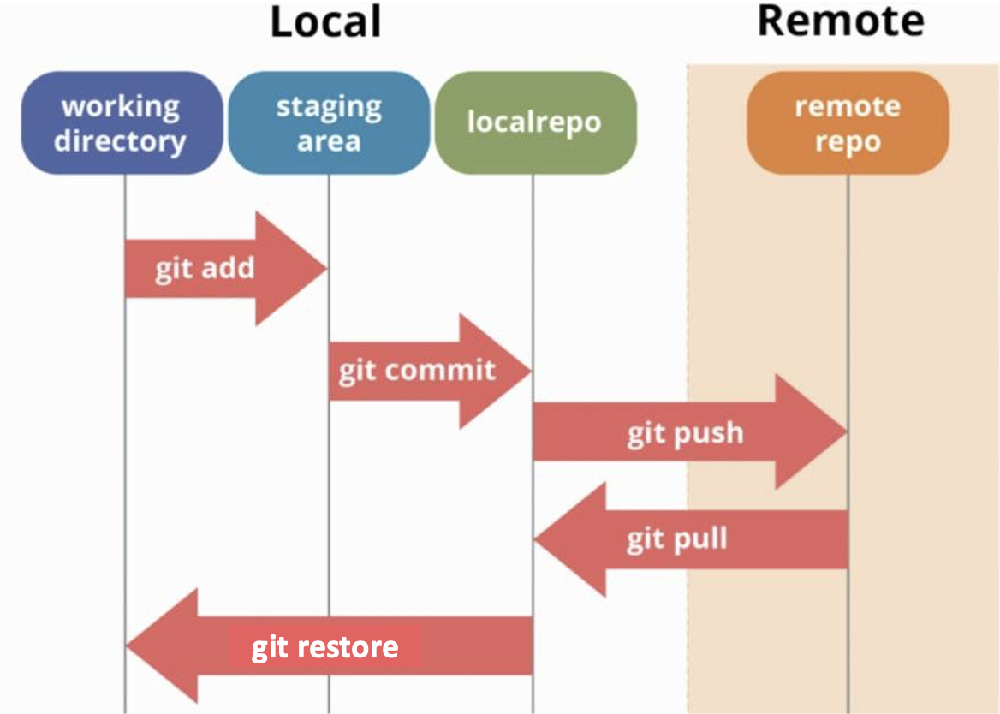

<div class="img-ref">

Source: <https://dev.to/mollynem/git-github--workflow-fundamentals-5496>

</div>

---

<!-- _class: section -->

# Part 1:
# Examining a Git Repository

---

# Useful Commands

<div class="no-bullets">

<div class="compact-lines">

- `git log`
  - shows the commits in a repository

</div>

<div class="compact-lines">

- `git blame`
  - shows when what part of file was changed last by which commit

</div>

<div class="compact-lines">

- `git diff`
  - shows changes between commits, commit and working tree, etc.

</div>

<div class="compact-lines">

- `git show`
  - shows both commit information AND commit diff

</div>

</div>

<br>

These commands have many different options for customizing the output (explored in Exercise 1)

---

# git bisect

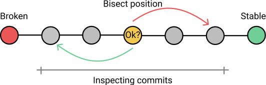

- Iteratively locate the commit where a change occurred
- Requires a linear history to work correctly

<!-- Speaker notes:
Git bisect uses a binary search algorithm to help you iteratively locate the commit where a change happened (bug was introduced, performance got worse, etc.)
Git bisect requires a linear history to work correctly
-->

---

# Examining a Git Repository: Exercises
- Exercise 1: `git log`, `git blame`, `git diff`, and `git show`
- Exercise 2: `git bisect`

Exercises can be found at: <https://github.com/C2SM/git-course/tree/main/advanced>

---

<!-- _class: section -->

# Part 2:
# Git Workflow

---

# Web Interface Workflow – Repository Level

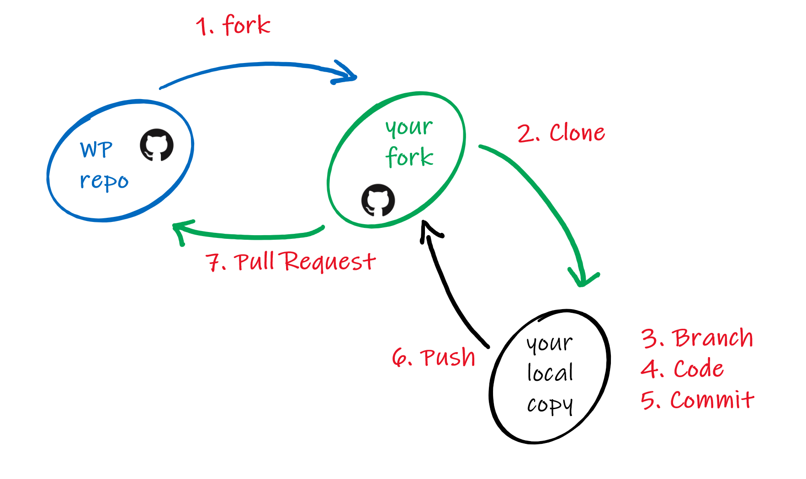

<div class="img-ref">

Source: <https://developer.wordpress.org/block-editor/contributors/code/git-workflow/>

</div>

---

# Web Interface Workflow - Branch Level

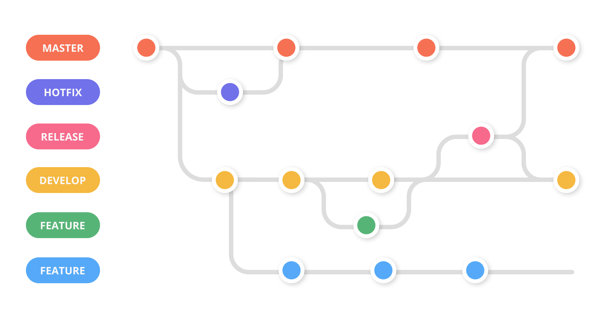

---

# .gitignore

- Tell Git to disregard files you don’t want committed.
- Best practice is to ignore binaries, intermediate files, files that can be generated from files in your repository, etc.

```
*~
*.exe
netcdf-*
bin
!bin/gen_info.sh
```

<br>


<!-- Speaker notes:
To avoid accidentally committing these, you can create a .gitignore file in the root directory of your repository
List all of the files you want git to ignore in the .gitignore file.  You can use wildcards to indicate file extensions
Add and commit your .gitignore file to the repository
-->

---

# .gitkeep
Git keeps track of files, not folders

Put an empty `.gitkeep` file in any folder you would like to keep in the repository

Commit the `.gitkeep` file to the Git repository

 > _Note_: this is a convention that has developed, not an official Git feature like `.gitignore`

<!-- Speaker notes:
To avoid accidentally committing these, you can create a .gitignore file in the root directory of your repository
List all of the files you want git to ignore in the .gitignore file.  You can use wildcards to indicate file extensions
Add and commit your .gitignore file to the repository
-->

---

# git stash
Allows you to save bits of work without committing them and reuse them late
Useful when:
- you need to pull changes, but have uncommitted changes
- you need to switch branch, but have uncommitted changes

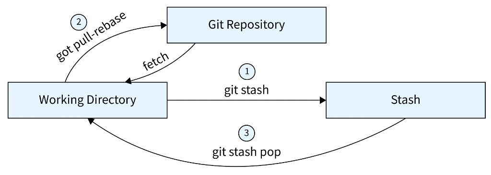

<div class="img-ref">

Source: <https://www.scaler.com/topics/git/git-stash-pop/>

</div>

---

# git worktree
Can checkout and work with multiple branches of a repository with a single clone
Worktrees share a single `.git` directory, which:

- **saves memory and time** compared to multiple clones
- keeps the git configuration **centralized**

Can build/test multiple branches simultaneously

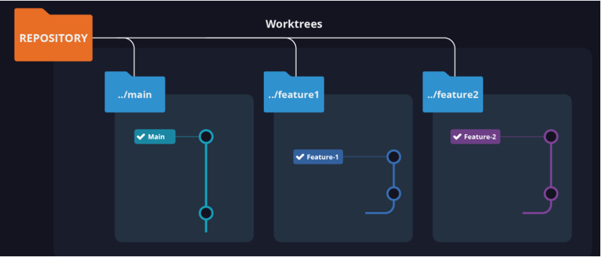

<div class="img-ref">

Source: <https://www.gitkraken.com/learn/git/git-worktree>

</div>

---
<!-- _class: section -->

# GitHub Web Interface Demonstration
<https://github.com/C2SM/git-workflow-practice>

---

# Git Workflow - Exercises

Exercise 3: `.gitignore`

Exercise 4: `git stash` and `git worktree`

Exercise 5: practice the git workflow

---

<!-- _class: section -->

# Coffee Break
# ☕

---

# git cherry-pick: Snagging one Commit


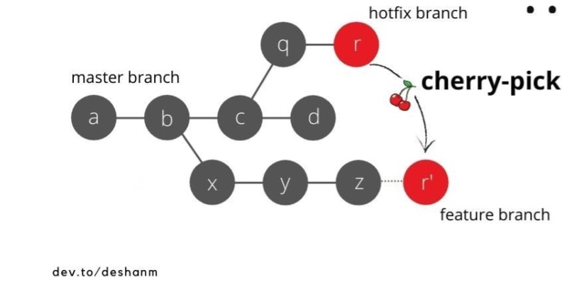

- Grabs one commit and puts it at the head of another branch.
- Uses a different commit ID for the same file changes.

<!-- Speaker notes:
Git cherrypick grabs one commit from one branch and puts it at the head of another branch, with a different SHA
Git rebase sometimes uses git cherrypick
Cherrypicking also rewrites history and therefore should be used with caution
-->

---

<!-- _class: section -->

# Custom Git Hooks

---

# Custom Git Hooks
Scripts to automate / enforce certain actions

Triggered when certain (pre-defined) events occur

Stored in `.git/hooks`

Named after the event they are associated with (e.g., `pre-commit`, `post-merge`, etc.)

Can be used for
- enforcing coding standards
- preventing accidental commits of sensitive data
- triggering automatic tests
- updating documentation

Samples already present!

---

# Git Workflow - Exercises

Exercise 6: `git cherry-pick`

Exercise 7: Custom Git Hooks

---

<!-- _class: section -->

# Part 3:
# Nesting Git Repositories

---

# Nested Repositories

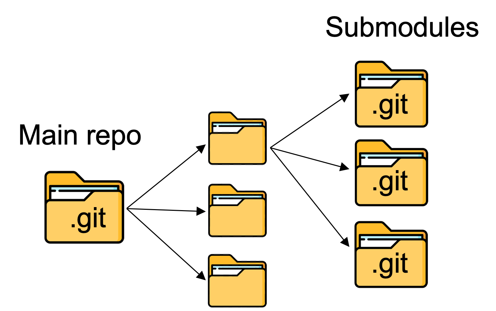

Why use it?

- **Modularity**: Break project into smaller, manageable pieces.
- **Version Control**: Each submodule has its own Git history and version tracking
- **Collaboration**: Multiple teams can work on submodules independently

Options:
- **Git Submodules**: Git's built-in mechanism
- **Git Subtrees**: Alternative approach

---

# Parent repository stores reference to external repositories

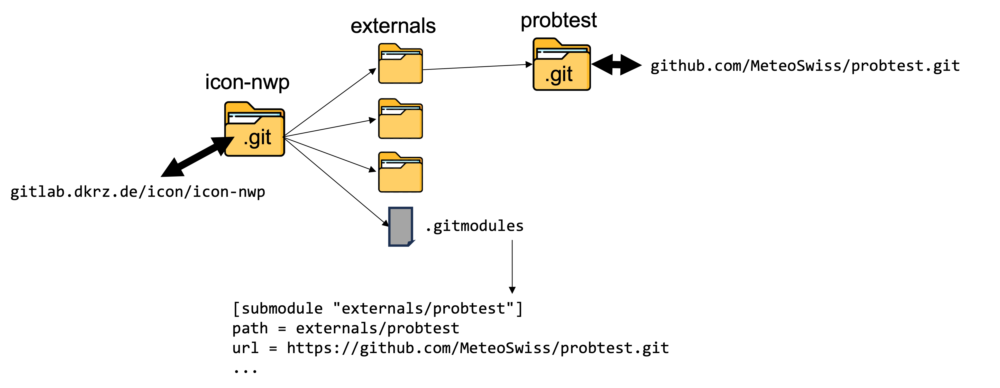

---

# Cloning a Repository with Submodules
`git clone`: By default, Git does NOT clone contents of submodules

`git clone --recurse-submodules`: Check out contents of any submodules when cloning parent repo

`git submodule update --init`: Get contents of submodules after cloning

---

# Git Submodules

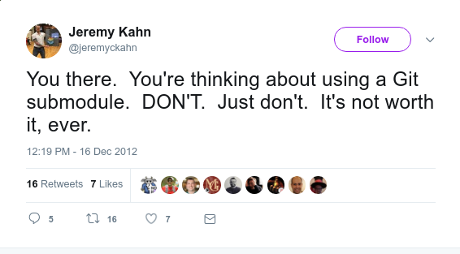

<!-- Speaker notes:
There are opinions
For tools and models of the C2SM community, submodules are used quite often
-->

---

# Nesting Git Repositories – Exercises
Exercise 8: `git submodule`

---

<!-- _class: section -->

# Part 4:
# Useful Tools and Resources

---

# Wide Range of Available Tools

<div class="columns">
<div>

Text editor plugins:
- [magit](https://magit.vc/) (Emacs): Wrapper for git commands
- [vim-gitgutter](https://github.com/airblade/vim-gitgutter) (vim): Improved git diff viewing

Integrated development environment (IDE) integration:
- [Visual Studio Code](https://code.visualstudio.com/)
- [RStudio](https://posit.co/download/rstudio-desktop/)
- [Eclipse](https://www.eclipse.org/downloads/)

</div>
<div>

Official Git tools:
- [git-gui](https://git-scm.com/docs/git-gui): Focuses on commit generation
- [gitk](https://git-scm.com/docs/gitk): Focuses on displaying diffs

Terminal prompt changer
- [fancy-git](https://github.com/diogocavilha/fancy-git)

[Git GUIs](https://git-scm.com/downloads/guis):
- [Git for Windows](https://gitforwindows.org/): Git BASH command line
- [TortoiseGit](https://tortoisegit.org/): Windows Shell Interface to Git

</div>
</div>

<!-- Speaker notes:
Gitk: Repository Browser
git gui focuses on commit generation and single file annotation and does not show project history
-->

---

# Git Resources
<http://git-scm.com/>: Official Git manual

<https://docs.github.com>: GitHub manual

<https://education.github.com/git-cheat-sheet-education.pdf>: Cheat sheet with useful GitHub commands for quick reference

---

<!-- _class: section -->

# Bonus Part

---

# git rebase: Alternative to git merge


<div class="columns">
<div>

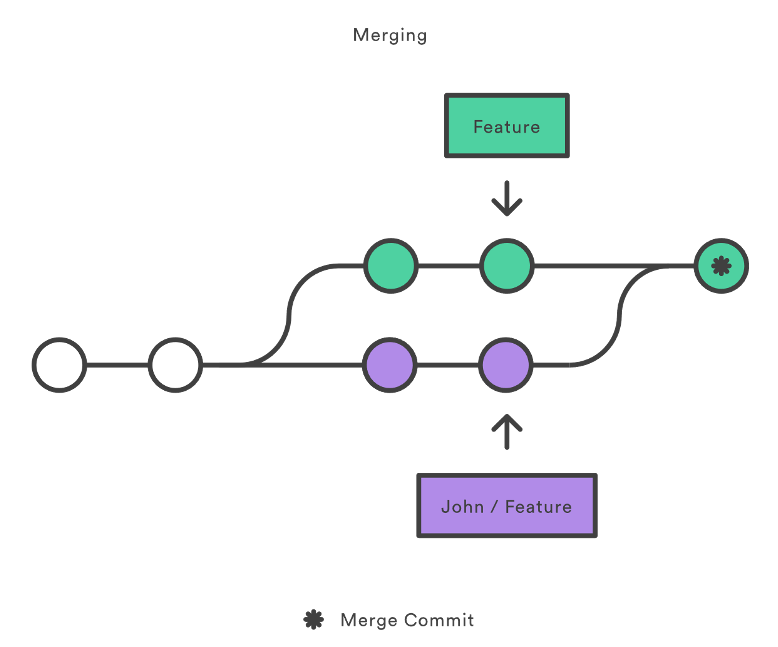

</div>

<div>

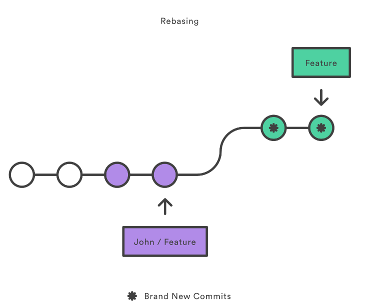

</div>

</div>

Commits are replayed in a different order
Advantage: keep cleaner commit history
Should NEVER be used in a shared branch

<div class="img-ref">

Source: <https://dzone.com/articles/merging-vs-rebasing>

</div>

<!-- Speaker notes:
git rebase is an alternative to git merge
Instead of merging commits, it replays commits in a different order
This allows you to keep a cleaner commit history and avoid unecessary merge commits
THIS CHANGES the HISTORY!  Should NEVER be used in a branch that is shared.  Use with caution
May require you to force push (git push –f) to a remote branch.  Use with caution.
-->

---

<!-- _class: section -->

# Questions? Comments?