<!-- _class: title -->
<!-- _paginate: false -->
<!-- _footer: "" -->

# Git: Next Steps

C2SM Git Courses · 8 October 2026
Michael Jähn, Mikael Stellio, Alitzel Macías Infante

---

<style scoped>
section {font-size: 25px;}
</style>

# Outline

<div class="columns">
<div>

<div class="compact-lines">

### Part 1: Your Git Toolbox
- Examining history: `log`, `blame`, `diff`, `show`
- Nesting repositories with submodules
- Ignoring files
- `git cherry-pick` and `git rebase`
- `git stash` and `git worktree`
- Custom Git hooks
- Large files with `git lfs`
- Exercises 1 – 7

</div>

</div>
<div>

<div class="compact-lines">

### Part 2: Working Together on GitHub
- Why a shared workflow
- A real example: the C2SM User Landing Page
- Issues, forks and branches
- Pull requests, checks and review
- Keeping your fork in sync
- GitHub and GitLab side by side
- Exercise 8

</div>

</div>
</div>

<div class="note">

You only need the **Git basics** for this course: `add`, `commit`, `push`, `pull`, `branch`.

</div>

---

<style scoped>
.schedule-list {
  font-size: 34px;
}
.schedule-list li {
  margin-block: 14px;
}
</style>

# Schedule

<div class="no-bullets schedule-list">

- **09:30 – 09:40** Welcome and overview
- **09:40 – 10:50** Part 1 · history, submodules and ignoring files → Exercises 1 – 3
- **10:50 – 11:10** Coffee break
- **11:10 – 11:50** Part 1 · moving, parallel work → Exercises 4 – 5
- **11:50 – 12:30** Part 1 · hooks and large files → Exercises 6 – 7
- **12:30 – 13:30** Lunch break
- **13:30 – 14:30** Part 2 · slides and live demonstration
- **14:30 – 15:00** Part 2 · Exercise 8 and wrap-up

</div>

---

<!-- _class: section -->

# Part 1:
# Your Git Toolbox

---

# Recap: the Local Workflow


- Everything up to `git commit` happens **on your machine**
- Only `git push` and `git fetch` talk to the server

---

# Examining History: Four Commands

<div class="no-bullets">
<div class="compact-lines">

- `git log`
  - which commits exist, by whom, and in what order

</div>

<div class="compact-lines">

- `git blame`
  - which commit last changed each **line** of a file

</div>

<div class="compact-lines">

- `git diff`
  - what changed between two points in the repository

</div>

<div class="compact-lines">

- `git show`
  - a single commit: message **and** its diff

</div>
</div>

<br>

Each takes many options. Exercise 1 explores the ones worth remembering.

---

<style scoped>
table {font-size: 20px;}
</style>

# `git log`: Shaping and Filtering

| Option | What it does |
| --- | --- |
| `--oneline` | one line per commit |
| `--graph --decorate --all` | the branch structure of the whole repository |
| `--stat` | which files each commit touched |
| `-3` | only the last three commits |
| `--author="Lauber"` | only commits by a given author |
| `-- path/to/file` | only commits touching that file |
| `-S "Have fun!"` | commits that **add or remove** that text |
| `-G "regex"` | commits whose diff matches a regular expression |

<div class="note">

Found a combination you like? Save it: `git config --global alias.lg "log --oneline --graph --decorate --all"`

</div>

---

# `git diff`: Choosing Two Points

<div class="no-bullets">
<div class="compact-lines">

- `git diff`
  - working directory vs. staging area

</div>

<div class="compact-lines">

- `git diff --staged`
  - staging area vs. last commit (what `git commit` would record)

</div>

<div class="compact-lines">

- `git diff main my-branch`
  - one branch against another

</div>

<div class="compact-lines">

- `git diff HEAD~10 HEAD~5 -- README.md`
  - two commits, restricted to one file

</div>
</div>

<br>

Hard to read in a terminal? Use `git difftool --tool-help` to see what your system offers, or the web interface: add `/compare` to any GitHub repository URL.

---

# Part 1 · Exercise 1

### `git log`, `git blame`, `git diff` and `git show`

<div class="note">

**Where you work:** the `git-course` repository itself - we examine its real history.
All exercises: <https://github.com/C2SM/git-course/tree/main/advanced>

</div>

---

# Nesting Repositories

- **Why?**
  - **Modularity** - break a large project into pieces that stand alone
  - **Independent history** - each piece keeps its own commits and releases
  - **Collaboration** - separate teams own separate pieces

<br>

- **Two mechanisms**
  - **Submodules** - Git's built-in approach, and the one C2SM models use
  - **Subtrees** - an alternative that copies content into the parent instead

---

# A Submodule Is a Pointer to One Commit


The parent repository records **one exact commit** of the submodule, not "the latest".

---

# Working With Submodules

<div class="no-bullets">
<div class="compact-lines">

- `git submodule add <url> <path>`
  - adds the submodule and creates `.gitmodules`

</div>

<div class="compact-lines">

- `git clone --recurse-submodules`
  - clones the parent **and** fills in the submodules

</div>

<div class="compact-lines">

- `git submodule update --init`
  - fills them in after an ordinary `git clone`

</div>

<div class="compact-lines">

- `git submodule update --remote --merge`
  - moves the pointer forward to the submodule's latest commit

</div>
</div>

<div class="warning">

A plain `git clone` gives you **empty** submodule directories. This surprises everybody once.

</div>

---

<style scoped>
section {font-size: 24px;}
</style>

# Submodules Divide Opinion

<div class="columns">
<div>

**In their favor**

- Built into Git, nothing to install
- The parent records an exact, reproducible commit
- The submodule stays a normal repository

</div>
<div>

**Against**

- Every clone needs an extra step
- Easy to commit a pointer you never pushed
- Detached `HEAD` inside the submodule confuses people
- Branch operations do not recurse by default

</div>
</div>

<div class="note">

C2SM models and tools use submodules a lot, so the cost is worth paying here. Learn the two or three commands that matter and the pain mostly disappears.

</div>

---

# Part 1 · Exercise 2

### `git submodule`

<div class="note">

**Where you work:** `advanced_git/conference_submodule`
You will need a fork of <https://github.com/C2SM/c2sm-git-example> - the same one you use in Exercise 8.

</div>

---

# Ignoring Files

- Tell Git to leave alone what should never be committed
- Build products, binaries, editor droppings, secrets, large data

```
*~
*.exe
netcdf-*
build/
!build/keep_this.sh
```

- Patterns are matched per directory; `!` re-includes something
- `git check-ignore -v <file>` tells you **which line** ignored a file

---

# Ignoring Files: the States


<div class="warning">

`.gitignore` only affects **untracked** files. A file already committed keeps being tracked until you run `git rm --cached <file>`.

</div>

---

# `.gitkeep`

- Git tracks **files**, never directories
- An empty directory simply will not be committed
- Convention: put an empty `.gitkeep` file inside it and commit that

<div style="flex-grow: 1;"></div>

<div class="note">

**Note:** `.gitkeep` is a community convention, not a Git feature. The name has no special meaning - any file would do.

</div>

---

# Part 1 · Exercise 3

### `.gitignore` and `.gitkeep`

<div class="note">

**Where you work:** `advanced_git/conference_planning`
Stuck? `reset_advanced_repo` gives you a clean start at any time.

</div>

---

# `git cherry-pick`: One Commit, Copied


- Takes a single commit and replays it on your current branch
- The copy gets a **new commit ID** - same content, different identity

<div class="warning">

Because the ID differs, do not later merge the branch you picked from: you would get the same change twice.

</div>

---

# `git rebase`: an Alternative to `git merge`

<div class="columns">
<div>

**Merge** - keeps both histories, adds a merge commit



</div>
<div>

**Rebase** - replays your commits on top, no merge commit



</div>
</div>

<div class="warning">

Rebasing **rewrites history**. Never rebase a branch other people have already pulled.

</div>

---

# Part 1 · Exercise 4

### `git cherry-pick` and `git rebase`

<div class="note">

**Where you work:** `advanced_git/conference_planning`
Stuck? `reset_advanced_repo` gives you a clean start at any time.

</div>

---

# `git stash`: Park Your Work


- For when you must switch branch or pull, but are not ready to commit
- `git stash push -m "message"`, then `git stash list`, then `git stash pop`
- `-u` also stashes untracked files
- Stashes are **local only** - they never reach a remote

---

# `git worktree`: Several Branches at Once


- Multiple working directories sharing **one** `.git`
- Cheaper than a second clone, and the configuration stays in one place
- Especially useful when switching branches means recompiling

`git worktree add ../conference_planning-feature feature`

---

# Part 1 · Exercise 5

### `git stash` and `git worktree`

<div class="note">

**Where you work:** `advanced_git/conference_planning`, plus the worktree it creates next to it.

</div>

---

<!-- _class: section -->

# Coffee Break
# ☕

---

# Custom Git Hooks

- Scripts Git runs automatically when a certain event happens
- Live in `.git/hooks`, named after their event, must be **executable**
- A non-zero exit status from a `pre-` hook **cancels** the operation
- `.git/hooks` is **not** part of the repository, so hooks are not shared by cloning
- Git ships `.sample` files for every hook - rename one to activate it

<div class="note">

Want hooks that everybody gets? Commit them to a folder and point Git at it with `git config core.hooksPath <folder>`, or use the [pre-commit](https://pre-commit.com/) framework.

</div>

---

# When Each Hook Fires


Typical uses: reject trailing whitespace, run a formatter, enforce a commit-message
format, block commits of secrets, run fast tests before a push.

---

# Part 1 · Exercise 6

### Custom Git hooks

<div class="note">

**Where you work:** `advanced_git/conference_planning`
Everything happens in its `.git/hooks` directory.

</div>

---

# Large Files: `git lfs`

- Git stores a **full copy of every version** of every file
- That is perfect for text and terrible for a 500 MB NetCDF file
- Git Large File Storage keeps a tiny **pointer** in the repository and the real bytes elsewhere


---

# Using `git lfs`

<div class="no-bullets">
<div class="compact-lines">

- `git lfs install`
  - once per machine: registers the filters

</div>

<div class="compact-lines">

- `git lfs track "*.nc"`
  - records the pattern in `.gitattributes` - **commit that file**

</div>

<div class="compact-lines">

- `git lfs ls-files`
  - which files are handled by LFS

</div>
</div>

<div class="warning">

LFS is not free: hosts put quotas on storage and bandwidth, and rewriting LFS history is painful. Before reaching for it, ask whether the data belongs in a data archive instead.

</div>

---

# Part 1 · Exercise 7

### `git lfs`

<div class="note">

**Where you work:** `advanced_git/conference_planning`
Entirely local - no remote and no LFS quota needed.

</div>

---

<!-- _class: section -->

# Part 2:
# Working Together on GitHub

---

# Why a Shared Workflow?

Three problems appear the moment a second person joins:

<div class="compact-lines">

- **Access** - nobody can push to a protected `main`, so "just push it" is not an option
- **Traceability** - a change needs a visible record of *why*, not only *what*
- **Review** - somebody should look at a change **before** it reaches everyone else

</div>

<br>

A web interface solves all three with the same object: the **pull request**.

<div class="note">

The Git commands you already know do not change. What follows is a convention layered on top of them.

</div>

---

# A Real Example: the C2SM User Landing Page

<https://github.com/C2SM/c2sm.github.io> → <https://c2sm.github.io>

<div class="compact-lines">

- Documentation for models, tools, datasets and HPC systems used across C2SM
- Written as plain Markdown, built into a website automatically
- Maintained by the core team, but **anyone in the group can contribute**
- Every pull request gets a **preview website** before anything is merged

</div>

<br>

We will walk through a real change to this repository, then you will practice the same
workflow on <https://github.com/C2SM/c2sm-git-example>.

---

# It Starts With an Issue

- An issue describes **what is wrong or missing, and why** - before any code is written
- It is the place to agree on an approach before someone spends a day on it
- Labels, assignees and milestones make a backlog searchable months later

<br>

- Write `Fixes #12` in a pull request description and GitHub **closes issue 12 automatically** when it merges

<div class="note">

A good issue is reproducible: what you did, what you expected, what happened instead.

</div>

---

# Fork and Branch


**Fork** when you cannot push to the original. **Branch** when you can. Either way the change arrives as a pull request.

---

# The Pull Request

<div class="compact-lines">

- A request to merge one branch into another, plus the conversation around it
- The **description** is the lasting record - say why, not just what
- Open it **early** as a draft to show work in progress
- Keep it small: a reviewer reads 200 lines carefully and 2000 lines not at all

</div>


---

# Automated Checks

- GitHub Actions run on every pull request, before a human looks at it
- On the landing page repository they check that Markdown links resolve and that the site still builds
- A failing check blocks the merge, so broken changes never reach `main`

<br>

- The same workflow deploys a **preview of the website for that pull request**:
  `https://c2sm.github.io/pr-preview/pr-<number>/`

<div class="note">

Reviewers can look at the rendered page, not just the diff. This is the single biggest reason the landing-page workflow works well.

</div>

---

# Code Review

<div class="columns">
<div>

**As the author**

- Small, focused changes
- Explain the reasoning
- Reply to every comment
- Push fixes as new commits

</div>
<div>

**As the reviewer**

- Comment, approve, or request changes
- Use **suggestions** - the author can apply them with one click
- Ask questions instead of issuing orders
- Approve when it is good enough, not perfect

</div>
</div>

<div class="note">

Review is about the change, never the person. "This function could be clearer" beats "you wrote this badly".

</div>

---

# Merging, and Staying in Sync

- **Merge commit** - keeps every commit and records the merge
- **Squash** - collapses the branch into one tidy commit (a common default)
- **Rebase** - replays commits with no merge commit
- Delete the branch afterwards; the pull request keeps the history


---

<style scoped>
table {font-size: 19px;}
section {font-size: 22px;}
</style>

# GitHub and GitLab Side by Side

C2SM works on both `github.com` and `gitlab.ethz.ch`. The **local Git commands are identical** - only the website and the CI file differ.

| Concept | GitHub | GitLab |
| --- | --- | --- |
| Proposed change | Pull request (PR) | **Merge request (MR)** |
| Close an issue automatically | `Fixes #12` / `Closes #12` | `Closes #12` |
| CI configuration | `.github/workflows/*.yml` | **`.gitlab-ci.yml`** |
| Sign-off on a change | Approve / request changes | **Approvals**, a required count |
| Static site hosting | GitHub Pages | GitLab Pages |
| Preview of a change | PR preview via an Action | Review Apps |
| Ownership rules | `CODEOWNERS` | `CODEOWNERS` |
| Update a fork | "Sync fork" button or `upstream` remote | `upstream` remote |
| Namespaces | User / organization | User / **group**, nestable |

---

<!-- _class: section -->

# Live Demonstration
<https://github.com/C2SM/c2sm.github.io>

---

# Part 2 · Exercise 8

### An issue, a fork, a pull request and a review

<div class="note">

**Where you work:** <https://github.com/C2SM/c2sm-git-example> in the browser, plus a clone of
your fork anywhere outside `advanced_git`.

</div>

You will review each other's pull requests, so **work in pairs**.

---

# Useful Tools

<div class="columns">
<div>
<div class="compact-lines">

**In your editor**
- [VS Code](https://code.visualstudio.com/) - built-in Git, GitLens
- [magit](https://magit.vc/) (Emacs)
- [vim-fugitive](https://github.com/tpope/vim-fugitive) (Vim)
- [JetBrains IDEs](https://www.jetbrains.com/)

</div>
<br>
<div class="compact-lines">

**Better diffs**
- [delta](https://github.com/dandavison/delta)
- [difftastic](https://difftastic.wilfred.me.uk/)

</div>

</div>
<div>

<div class="compact-lines">

**In the terminal**
- [gh](https://cli.github.com/) - pull requests and issues from the shell
- [lazygit](https://github.com/jesseduffield/lazygit) - terminal interface
- [tig](https://jonas.github.io/tig/) - history browser

</div>
<br>
<div class="compact-lines">

**Graphical**
- [GitHub Desktop](https://desktop.github.com/)
- [Git GUIs](https://git-scm.com/downloads/guis) - a long list

</div>

</div>
</div>

---

# Where to Look Things Up

<div class="compact-lines">

- The Git book, free and genuinely good: <https://git-scm.com/book>
- Git reference: <https://git-scm.com/docs>
- GitHub documentation: <https://docs.github.com>
- GitHub cheat sheet: <https://education.github.com/git-cheat-sheet-education.pdf>
- When something has gone wrong: <https://dangitgit.com>
- Topics beyond this course: [Expert_Topics.md](https://github.com/C2SM/git-course/blob/main/Expert_Topics.md)

</div>

<div class="warning">

Language models are often useful for Git because the documentation is so good. They also invent flags that do not exist. Check `git help <command>` before running anything you do not recognize - especially anything with `--force`.

</div>

---

# References

<div class="compact-lines">

- Chacon, S. & Straub, B. *Pro Git*, 2nd ed. Apress, 2014. <https://git-scm.com/book>
- Git Project. *Git Reference Documentation* - `git-log`, `git-diff`, `git-submodule`, `git-cherry-pick`, `git-rebase`, `git-stash`, `git-worktree`, `githooks`. <https://git-scm.com/docs>
- Git LFS Project. *Git Large File Storage Documentation*. <https://git-lfs.com>
- pre-commit. *A Framework for Managing Multi-Language Pre-Commit Hooks*. <https://pre-commit.com>
- GitHub, Inc. *GitHub Docs*. <https://docs.github.com>
- GitLab B.V. *GitLab Docs*. <https://docs.gitlab.com>
- C2SM. *c2sm.github.io* - the User Landing Page used as the worked example. <https://github.com/C2SM/c2sm.github.io>

</div>

---

<!-- _class: section -->

# Questions? Comments?
