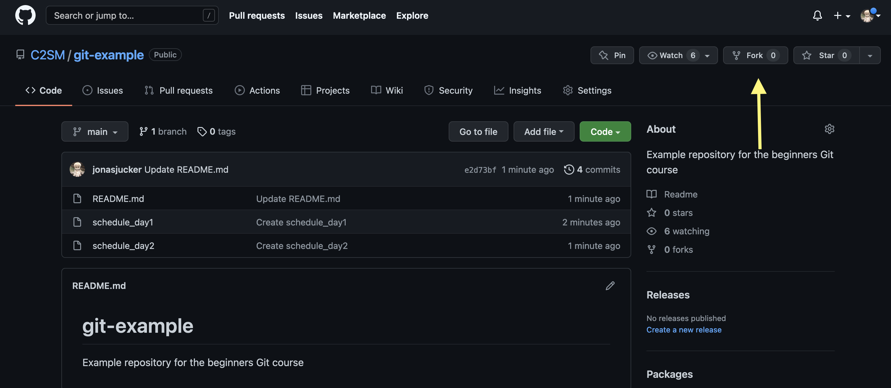
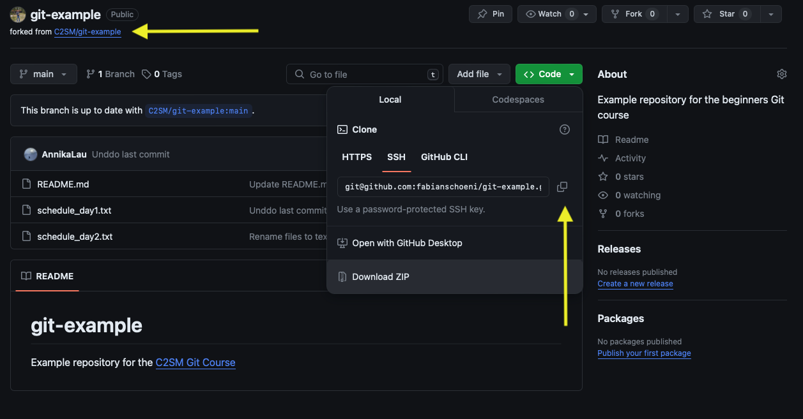
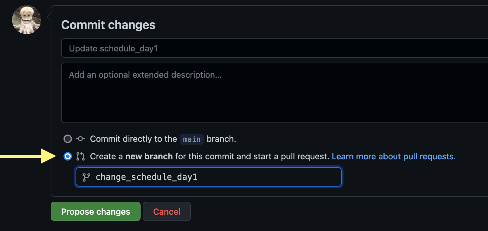

# Exercise 7

## Objective
* Access code from a Git web interface
* Push code changes to a Git web interface
* Examine the code repository on a Git web interface

## Helper Functions
The following helper functions in the file *helpers.sh* are written by C2SM and are **NOT** **part of Git**. They will set up simple repositories for you that have a short Git history, so that you have something to work with.

For this exercise, we will use the following functions from this file:
   * `init_exercise`: This will create the *beginners_git* directory in the parent directory of the *git-course* directory. It will also delete any old version of the *beginners_git* directory, so don't use the *beginners_git* directory to save any work.
   * `reset`: This will delete the *beginners_git* directory and allows you a clean restart of the exercise in case you messed it up completely.

## Remarks   

> **Note:** Any text enclosed in `<>` denotes a placeholder to be replaced with a specific string appropriate to your context, i.e. delete `<>` and replace it with the appropriate word.

> **Note:** The exercises require you to use basic Unix commands. If you are not familiar with Unix systems, we have listed all the necessary commands in the file [Basic Unix Commands](Unix_Commands.md).

If everything is still set up from the last exercise, can continue with [this exercise](#exercise) directly.
Otherwise, please refer to the [Initialization from Exercise 1](Exercise_1_basic_commands.md#initialization).

## Exercise

In this exercise, we will work with a repository hosted on the GitHub website.

First, we'll create a fork of the repository so that you can have your own copy of a C2SM repository to work with.  A fork is a complete copy of a repository into your own account, where you have full permission to make any changes you want to your forked repository. To create your fork, open another tab in your browser and navigate here: https://github.com/c2sm/git-example

**Use the web interface to make a fork:**

### Clone the fork

GitHub will indicate at the top left that this repository has been forked (left arrow).

Now copy the forked repository to your local workspace using the link (right arrow, dropdown from `Code`). If you have an SSH key on GitHub that connects your local Git to GitHub, use the SSH link to clone, otherwise use HTTPS.

> **Note about HTTPS**: If you clone the repository with HTTPS, you will not be able to exchange any information with the remote repository without setting up a token (`git push`, `git pull` and `git fetch` will NOT work). Follow the instructions in [Create a user token to use HTTPS for working with remote repositories](../token.ipynb) to do so.
However, we strongly recommend that you create an SSH key for GitHub if you plan to work with it in the future. It will make things much easier!

We don't want the repository in our _git-course_ repository. So make sure you are in the _beginners_git_ directory instead. Use the [Basic Unix Commands](Unix_Commands.md) we provided to navigate there in case you are in the wrong directory.

1. Navigate into beginners_git repo if not there already.

2. Use `git clone <path_to_repository>` to download your forked repository.

3. Navigate into the cloned repository.

### Examine the repository
Let's examine the repository.  Does it have any remotes?  What branches are in it?  

1. Use `git remote -v`, `git branch -a`, and `git status` to examine the repository.

You should have noticed that your local repository has a remote called "origin" pointing to your fork on GitHub.  This is the default behavior when you use `git clone` to copy a repository.

### Add to local repository
Next, let's create a new branch and add a commit to it.

1. Use `git switch -c <branch_name>` to create a new branch.
2. Make a change in *schedule_day1.txt* and commit the change to your new branch.

### Send local information to GitHub

Now, let's send our new branch to our GitHub fork.
1. Push your local changes to the remote repository using `git push origin <branch_name>`

### Examine the GitHub repository

Go back to GitHub and take a look at your forked repository.  

Let's use the web interface to examine the repository. Try the following things there:

1. Find the list of commits and examine the files for a specific commit.  

2. Change a file and use the web interface to make a new commit to a new branch and automatically create a pull request.

3. Find the pull request and take a look at it.

### Update local repository using git fetch

Now, let's get the commit we made on GitHub into our local repository.   

1. Use `git fetch origin` to download the new commit from your fork.
2. Check the status of your Git repository.

Our new commit has been downloaded into a remote branch, but is not yet available in our local branch.

3. Use `git merge <remote_name>/<branch_name> -m '<commit_message>'` to sync up your local branch with the remote one.

### Update local repository using `git pull`

Let's examine the difference between `git fetch` and `git pull`. We just used `git fetch` to get a commit from our remote repository, and then we used `git merge` to merge it into our local branch.  

First, go back to the web interface and use it to make a new commit by editing a file in the branch you created earlier.

Next, let's merge that commit into our repository.

1. Use `git pull origin` to download the new commit from your fork.
2. Take a look at your local branch. You should see that the commit you made has already been merged into your local branch automatically, because `git pull` does both `git fetch` AND `git merge` automatically.