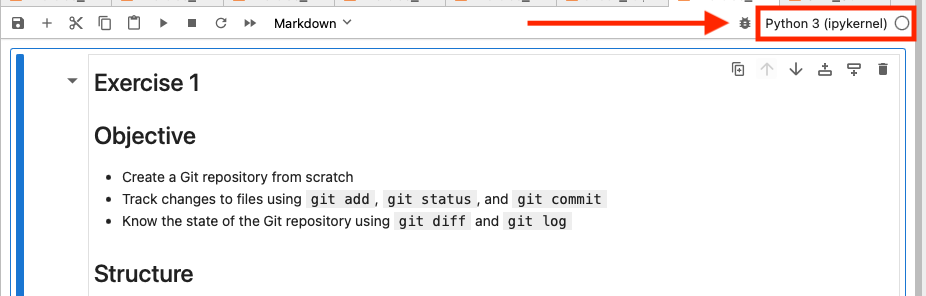
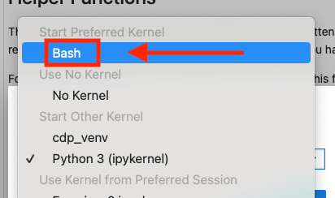

### Search for bash Kernel installation

For the Git course, we will be using a special notebook that allows us to write and run commands just like we would in the computer's terminal. To make this possible, we use a special Juypter kernel (bash-kernel) in our Jupyter notebook. Think of it as a plugin that helps your notebook understand and execute terminal commands. We need to make sure that this bash kernel is set up before we start the course. To do this, first run the cell below and follow the steps based on the output of the cell below:


```python
# import sys
import sys

# Check if the 'bash_kernel' is installed
try:
    import bash_kernel
    print("Bash kernel is installed.")
except ImportError:
    print("Bash kernel is not installed.")
```

### If the above cell returned: ``Bash kernel is not installed.``

This means that your bash kernel is not yet installed and you need to install it yourself.

* To do so, open a terminal and run the following command:

    ```bash
    python -m bash_kernel.install
    ```
* After that, restart this Notebook and run the above cell again to verify that your installation was successful.
* Continue with instructions below "If the above cell returned: Bash kernel is installed" to select the bash kernel.
      


### If the above cell returned: ``Bash kernel is installed.``

Perfect! The kernel is already installed, now we only need to properly select it.

* Click on the kernel selection in the top right of your Jupyter Notebook:

<div style="text-align: center;">
  
</div>

* Select the Bash kernel:

<div style="text-align: center;">
  
</div>


***Now you're all set to run Bash commands in your notebook!***

