<!-- _class: title -->
<!-- _paginate: false -->
<!-- _footer: "" -->

# C2SM Git for Beginners Workshop 2026

26 March 2026

Annika Lauber, Mikael Stellio, Michael Jähn

---

# Schedule

- **9:30 - 10:30** Introduction to Git
- **10:30 - 11:00** Git Branches
- **11:00 - 11:15** Coffee Break
- **11:15 - 12:00** Merge, Restores, Delete, .gitignore
- **12:00 - 13:00** Lunch
- **13:00 - 13:30** Remote Repositories
- **13:30 - 14:00** Merge Conflicts
- **14:00 - 15:00** Repository Managers

---

<!-- _class: section -->

# Part 1:
# Introduction to Git

---

# Why Use a Version Control System?

- Tracks file changes in a documented way

    - Restore previous versions
    - Understand what happened / cahnged between different versions
    - Record reasons for changes

- Allows to work simultaneously on the same code (when using remote server)
    - Alone (on different computers)
    - Multiple people in a collaboration
- Maintain several parallel versions of the same code in a systematic way
- Many tools available (web -based services, graphical interfaces, etc.)

---

# Different Version Control System (VCS)

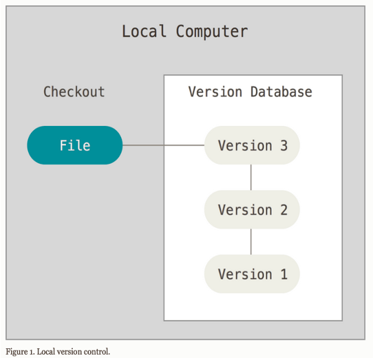

Local VCS

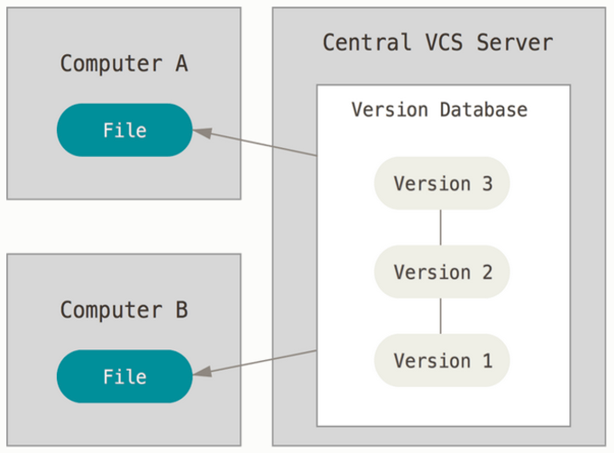

Centralized VCS (e.g., SVN)

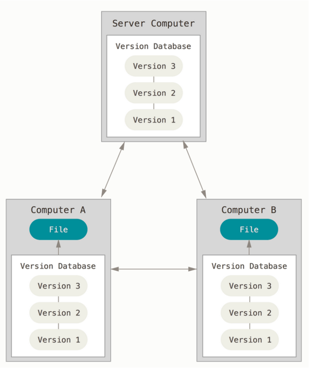

Distributed VCS (e.g., Git)

_Source: book ProGit_

---

# Why Git?

- Designed for collaborative, open-source workflows
- Distributed
    - Easy and flexible code exchange
    - Back-up your code
- Widely used, fast and efficient

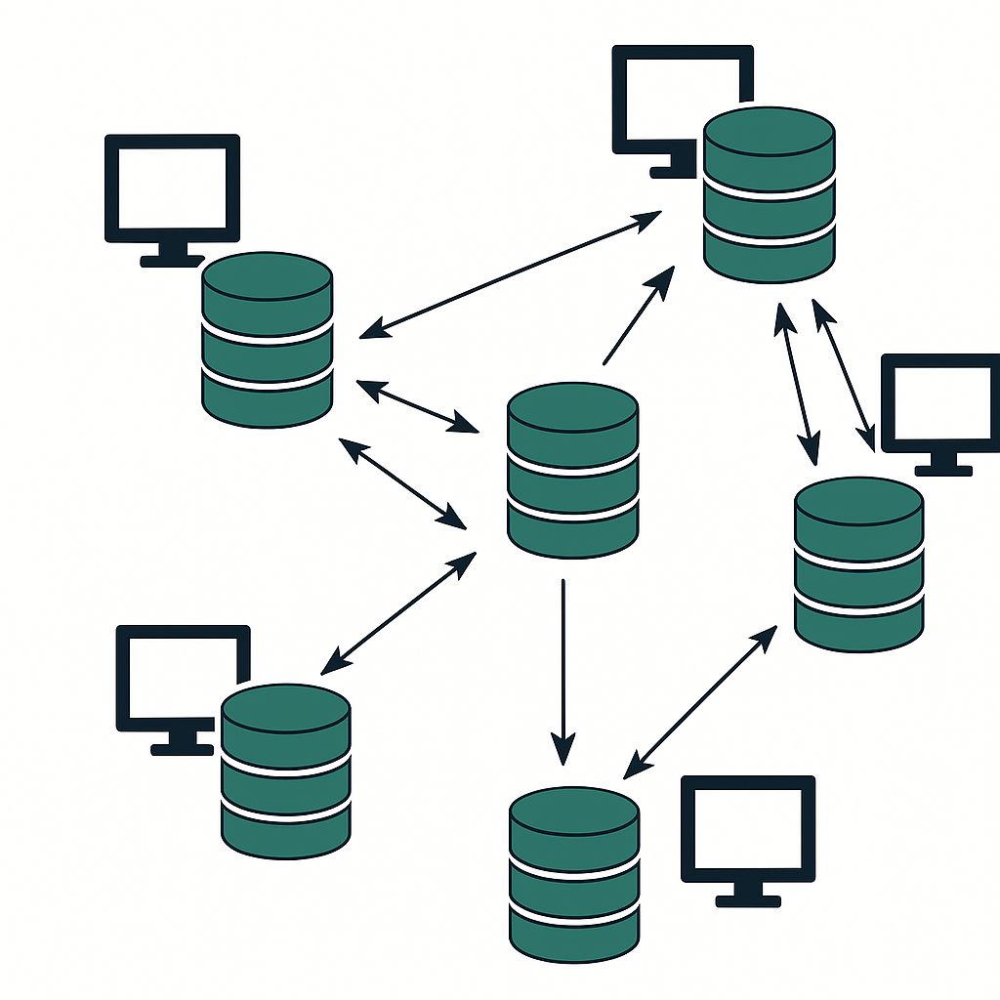

---

# Happy Birthday, Git!

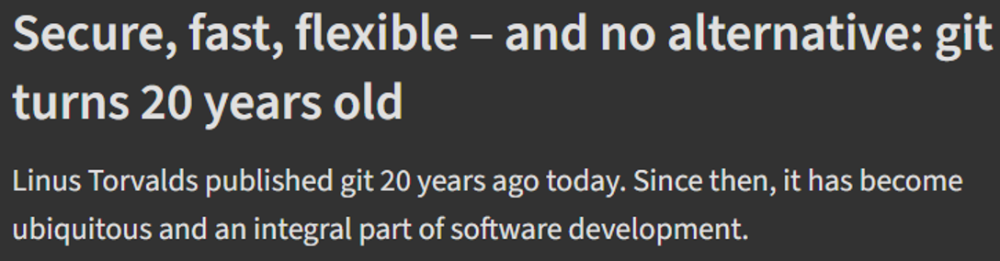

_"I'm an egotistical bastard and name all projects after
myself. First 'Linux', now 'git'", says Linus Torvalds
about himself. git is British slang for "stubborn people
who think they're always right and argue around"._

https://www.heise.de/en/news/Secure-fast-flexible-and-no-alternative-git-turns-20-years-old-10340526.html

---

# Practical Example: File for the Planing of a Conference

**Without versioning**

conference_schedule_v0.txt
conference_schedule_v1.txt
conference_schedule_v2.txt
conference_schedule_v2_dj.txt
conference_schedule_v2_orch.txt
conference_schedule_v3.txt

- Lots of different versions of same file
- Who remembers which one is what?

**With versioning**

conference_schedule.txt
.git (stores version history, date and authors of changes, etc.)

- Only one working file
- History of file documented
- Easy to combine

---

# Local Git Workflow

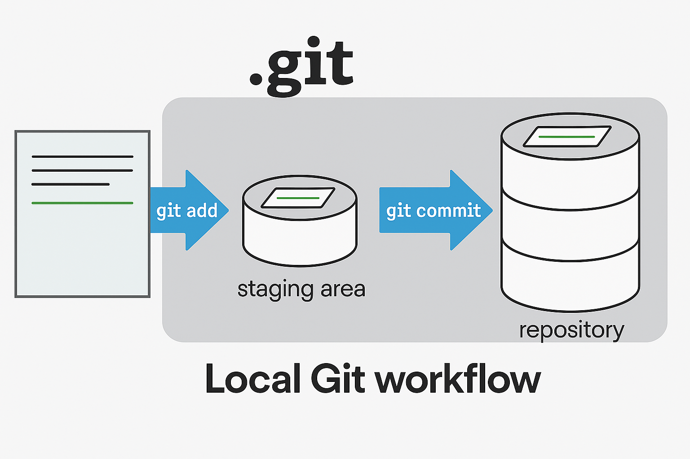

---

# Important Git Commands

- `git init`:
    - Creates empty Git repository
    - Creates _main_ branch by default
    - Creates the _.git_ folder and contents

- `git add`:
    - Saves code changes to staging area
    - Can add all or only some of the current code changes

- `git commit`:
    - Saves changes from staging area to the repository
    - Creates a unique commit ID
    - Saves a log message for the user

---

# Commit Messages

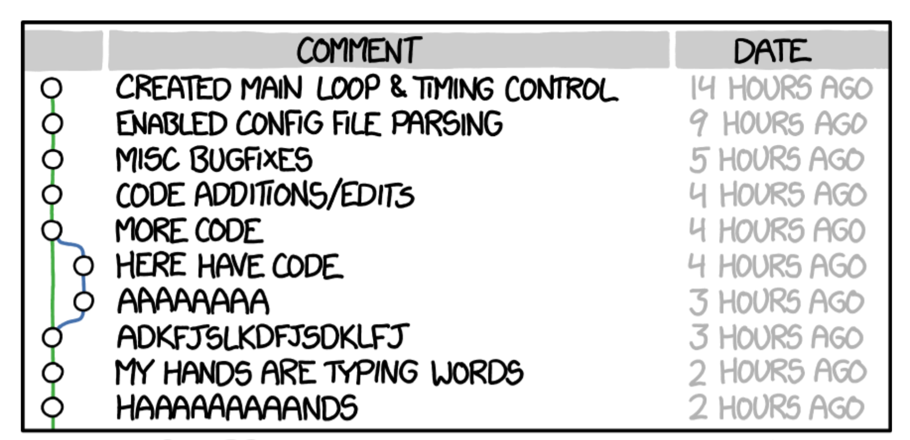

---

# Important Git Commands

- `git log`

    - Displays the log of all commits

- `git status`
    - Shows the status of the working copy
    - States which files have been placed in the staging area
    - Shows which files have been modified but not placed in staging area

- `git diff`
    - Shows changes between two versions of the code

---

# Important Remarks

It is **difficult to mess something up** with Git – don’t be afraid of it!

**Read what Git tells you**, it is trying to help you!

---

# Accessing Exercises

This git course is available at:
https://github.com/C2SM/git-course

→ Select the «beginner» folder to access exercises,
 e.g. «Exercise_1_basic_commands.md»

---

# JupyterLab

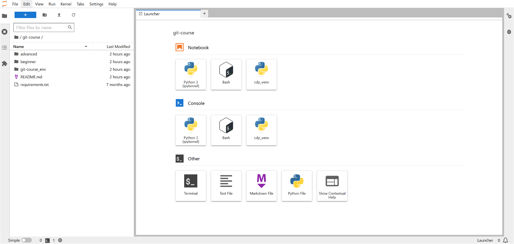

---

# https://github.com/C2SM/git-course/blob/main/beginner/Unix_Commands.md

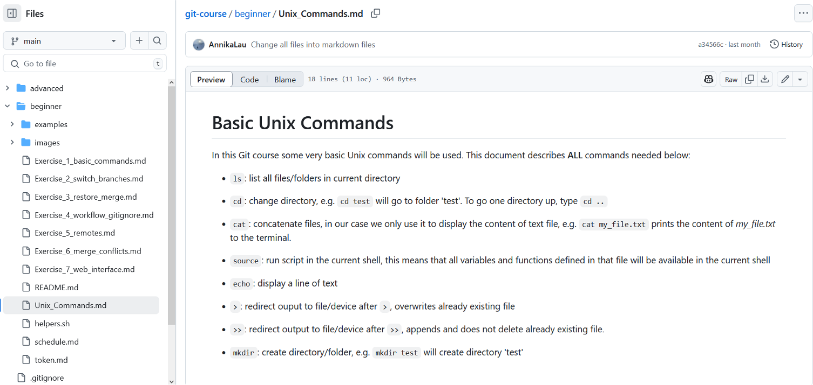

---

# Exercise 1

- Create Git repository from scratch
- Track changes in files using `git add`, `git status` and `git commit`
- Know state of Git repo using `git diff` and `git log`

---

<!-- _class: section -->

# Part 2: 

# Git Branches

---

# Remark

- Git ≥v2.23: `git switch` and `git restore`.

- Older versions: `git checkout` for both.

We will use `git switch` and `git restore` for simplicity
(`git checkout` commands in brackets)

---

# Git Branches

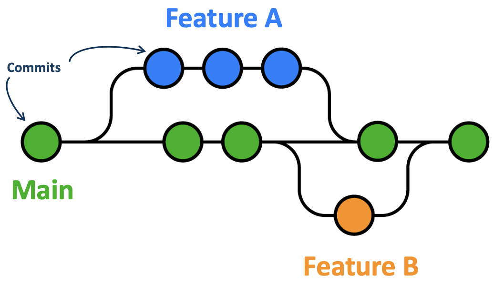

Adapted from <https://blog.nobledesktop.com/learn/git/git-branches>

- Multiple versions of your code
- Branch = copy of your code
- Git: create, merge and delete branches
- Advantages:
    - Easy collaboration with others
    - Experiment with new features
    - Revert changes if necessary

---

# Git Branches

- Make changes, without affecting the main version
- Multiple brances co-exist in parallel (different versions of same file)

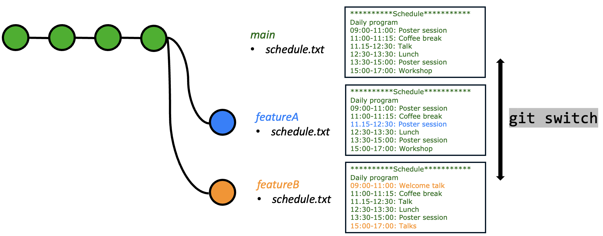

---

# Exercise 2

- Work with branches
- Switch between branches using `git switch`

---

<!-- _class: section -->

# Part 3:

# Merge, Restore and Delete

---

# Merge Branches

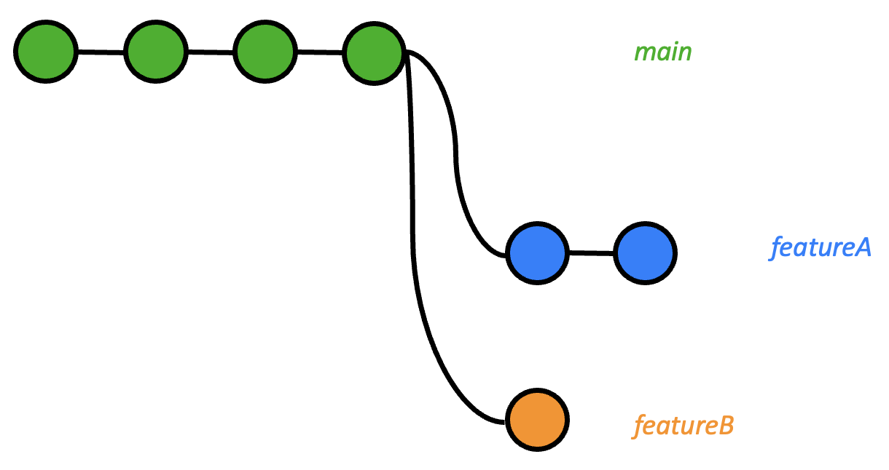

---

# Fast-Forward Merge

- Linear history between _main_ and _featureA_

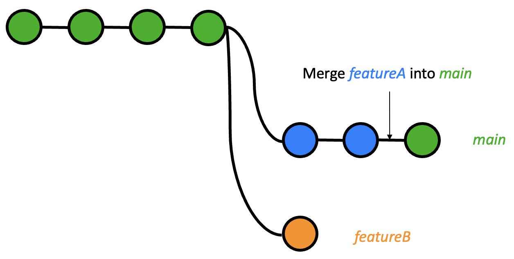

---

# 3-Way Merge

- Commits between _main_ and _featureA_

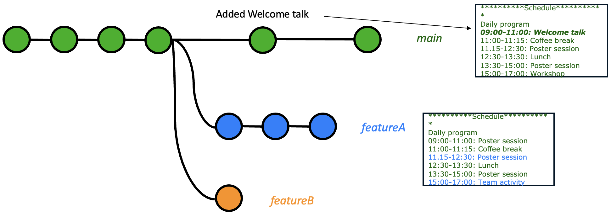

---

# 3-Way Merge

- Commits between _main_ and _featureA_

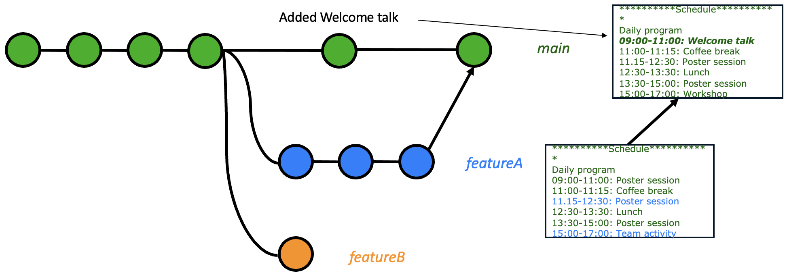

---

# 3-Way Merge

- Delete branch after merge

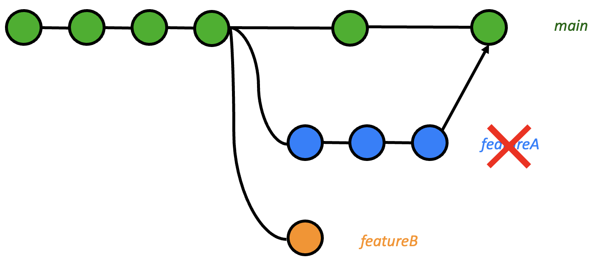

---

# Git Restore

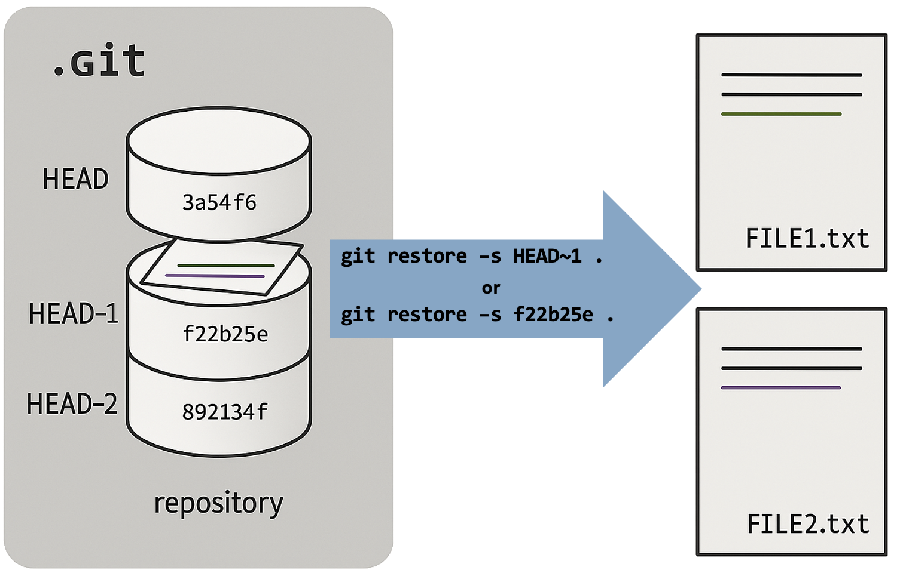

---

# Important Git Commands

- `git restore`
    - Deletes unstaged changes in working directory
    - `-s <commit ID>`: Changes file to the state at specific commit ID across branches or back in history
    - Can be used for single files (`<file_x>`) or the entire repository (`.`)

- `git merge <source branch>`
    - Combines source branch with target branch (= current branch)
    - Does not create new commit unless specified or needed (depends on your config settings)
    - Called from target branch

- `git branch`
    - list branches in local repository
    - `-a`: list all branches (remotes included)
    - `-d`: delete branch (if already merged into HEAD)
    - `-D`: delete branch (force)

---

<!-- _class: section -->

# Part 4:

# Practice workflow and .gitignore

---

# Understanding .gitignore

- Specifies intentionally untracked files by Git
- Helps maintaining a clean repository
- Examples: binary files, temporary files, log files, etc.
- Example .gitignore:

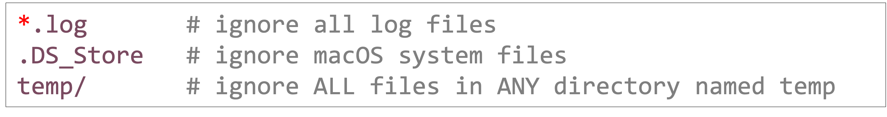

---

# Important Git Commands

- `git init`: creates a new repository
- `git status`: show the status of working tree (gives list of modified files)
- `git diff`: show differences between commits
- `git add`: add file to the selection of files to be committed (staging area)
- `git commit`: action to create a commit (snapshot of your project at a certain time)
- `git log`: show history of the commits
- `git switch`: switch branches
- `git restore`: restore working tree files
- `git merge`: merge changes from another branch

---

<!-- _class: section -->

# Part 5:

# Remote Repositories

---

# Remote Repositories

- Git repositories are usually hosted on a server (with or without web interface)
- Users clone repository to work on it locally
- The Git server is a "remote" for the local repository

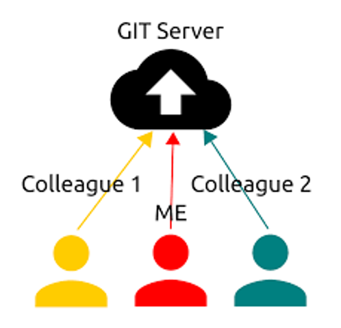

Source: <https://medium.com/swlh/continuous-integration-with-arduino-ce3714c19b44>

---

# Remote Repositories

- Git automatically connects remote and local repositories when cloning
- The remote repository is called "origin" by Git

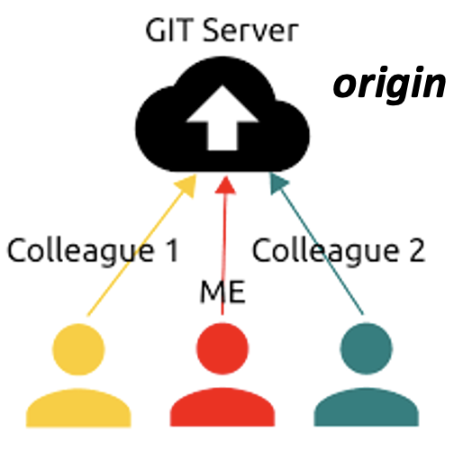

Source: <https://medium.com/swlh/continuous-integration-with-arduino-ce3714c19b44>

---

# Remote Repositories

- Remotes don‘t have to be web-hosted
- Can have multiple remote repositories

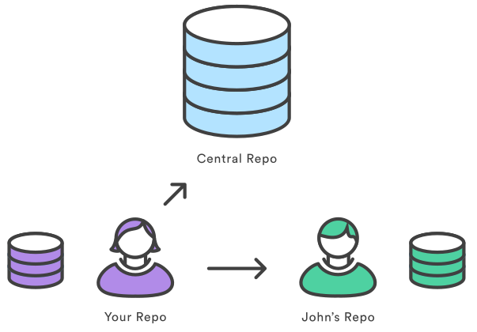

Source: <https://east.fm/refcards/git/sync/syncing.html>

---

# Remote Branches

- Your local repository will have local branches AND remote branches
- You can set up local branches to track the remote ones

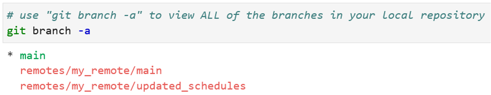

---

# Exchanging Code with Remote Repositories

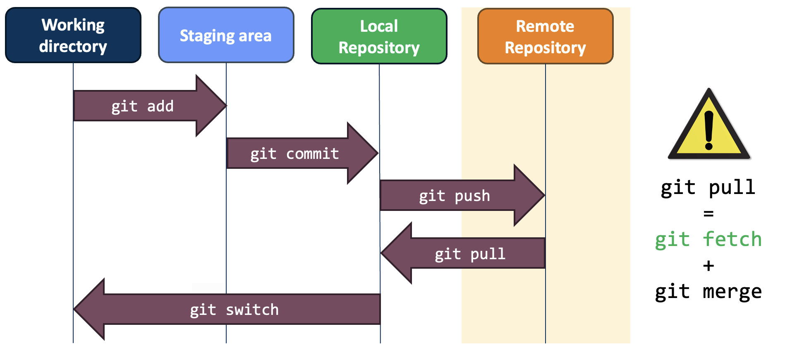

Modified after <https://salesforcecodex.com/salesforce/useful-git-commands/>

---

# Exercise 5: Remote Repositories

- Add a remote repository
- Examine remote branches
- Exchange information with a remote repository

---

<!-- _class: section -->

# Part 6:

# Merge conflicts

---

# Merge conflicts

- Modifications have been made on both branches you are merging

    AND

- If you have both modified the same line in a file or one person has
deleted a file another has modified

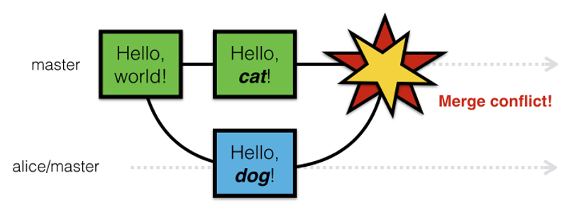

---

# Merge conflicts

- Git will stop the merge and notify you that you have conflicts
- You must resolve these conflicts before the merge can be completed.

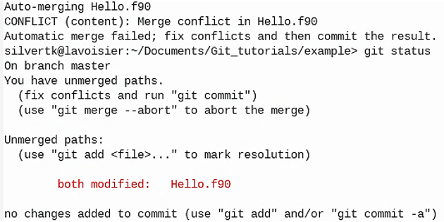

---

# Merge conflicts

- To resolve conficts, there are basically two options:

1. Choose the local or the remote version of a file:

    `git restore my_file --ours/theirs`
    (git checkout my_file --ours/theirs)

2. Open file, find conflict markers and decide how to solve the conflict:

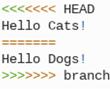

---

# Merge Conflicts

- Use `git add` to indicate that the file is ready for the merge

- Once all the conflicted files are resolved and added to the staging area, you use
`git commit` to finalize the merge

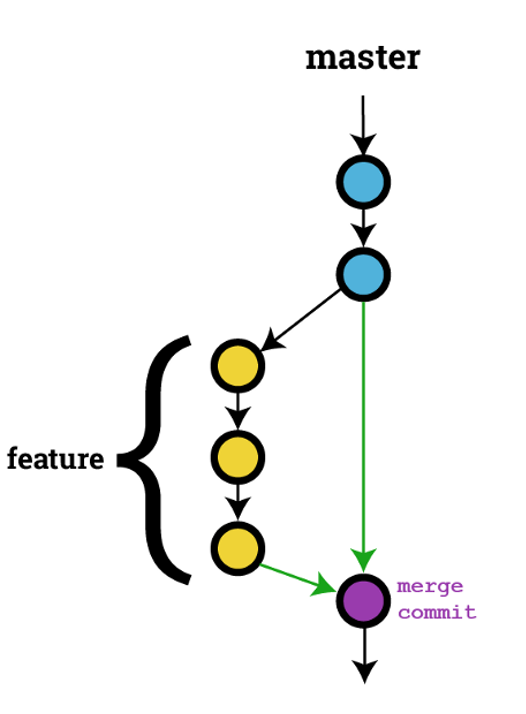

<https://haydar-ai.medium.com/learning-how-to-git-merging-branches-and-resolving-conflict-61652834d4b0>

---

# Exercise 6: Merge Conflicts

- Learn how to deal with merge conflicts:
    - Undo merge
    - Choose preferred version
    - Adapt file directly

---

<!-- _class: section -->

# Part 7:

# Repository Managers

---

# Repository Managers

- Interfaces for Git repositories
- Can use the web service or install locally
- Pricing varies – check for academic discounts!
- Examples:
    - C2SM hosts software on GitHub web interface
    - Empa and IAC use local Gitlab servers

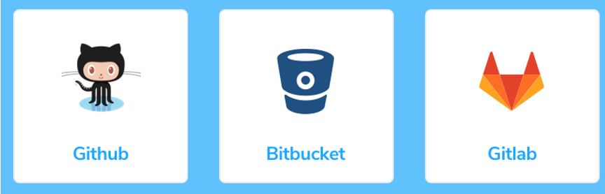

---

# Repository Manager Features

- Easily examine commits and files
- Collaboration tools (more later!)
- Issue reporting
- Code review
- Pull/merge requests
- Automation of testing

---

# Single User or Small Group Workflow

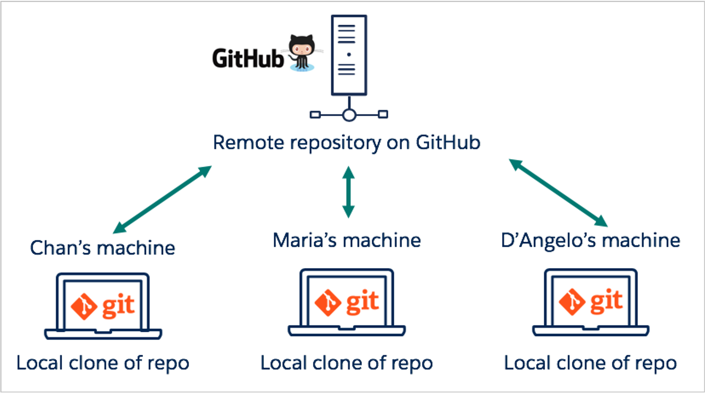

<https://blog.devgenius.io/entering-into-devops-01-git-basics-2898fbbb4b5c>

---

# Large Group Workflow: Using Forks

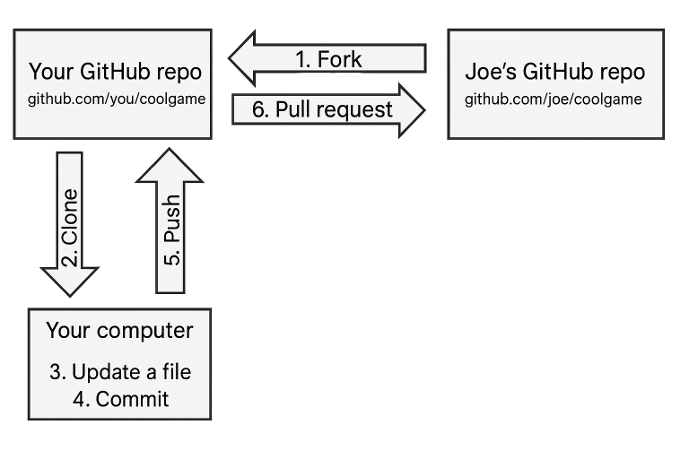

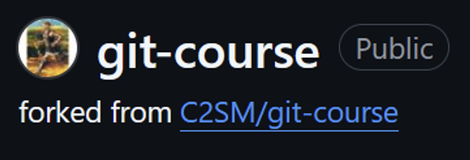

<http://www.programmersought.com/article/4701192164/>

---

# Exercise 7: Repository Managers

- Access code from a Git web interface
- Push code changes to a Git web interface
- Examine the code repository on a Git web interface
